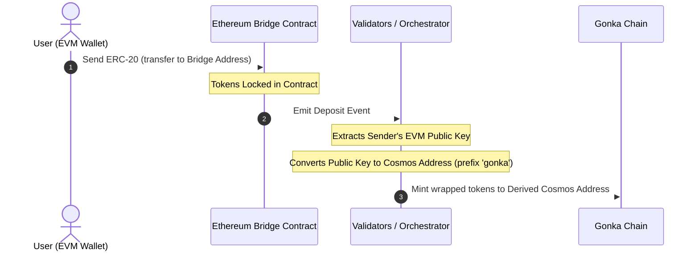
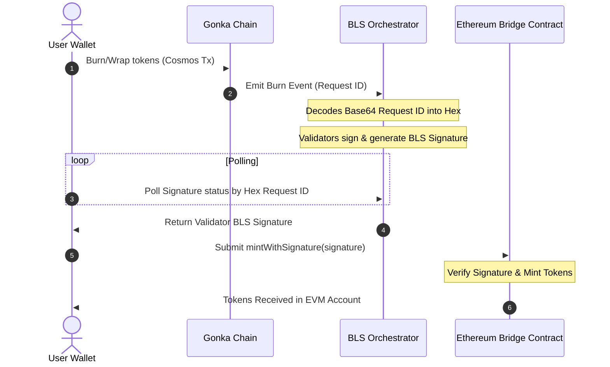

# Technical Integration Guide: Exchange & Bridge Widget

This guide provides technical specifications, architectural designs, and implementation steps for community developers who want to recreate the Exchange & Bridge Widget within their own custom dashboards.

---

## 1. Architectural Overview

To prevent structural confusion, the asset flows for deposits and withdrawals are split into two separate, independent processes.

### A. Deposit Flow (EVM to Gonka) & Address Derivation
During a deposit, tokens are locked on Ethereum, and equivalent wrapped tokens are minted on Gonka based on the derived Cosmos address of the sender's EVM public key. This is where address derivation mismatches can occur:



### B. Withdraw / Unwrap Flow (Gonka to EVM)
During a withdrawal, tokens are burned on the Cosmos side, validator BLS signatures are polled, and then claimed (minted) on the Ethereum side:



---

## 2. Deposit Functionality

### A. IBC Deposits (Cosmos to Gonka)
IBC deposits transfer assets directly from Cosmos source chains (e.g. Osmosis, Cosmos Hub, Injective) to Gonka.

1. **Enable & Connect Source Chain**: Query Keplr for the source chain credentials.
```typescript
async function connectSourceChain(chainId: string) {
  const walletProvider = (window as any).keplr;
  if (!walletProvider) throw new Error("Cosmos wallet extension not found.");
  
  await walletProvider.enable(chainId);
  const offlineSigner = walletProvider.getOfflineSigner(chainId);
  const accounts = await offlineSigner.getAccounts();
  return { address: accounts[0].address, offlineSigner };
}
```

2. **Resolve Channel Routing**: Query the Gonka RPC channel metadata (`/ibc/core/channel/v1/channels`) to resolve counterparty paths.
```typescript
async function resolveIbcChannel(apiEndpoint: string, targetChainId: string): Promise<string | null> {
  const response = await fetch(`${apiEndpoint}/ibc/core/channel/v1/channels`).then(r => r.json());
  const channels = response?.channels || [];

  for (const channel of channels) {
    if (channel.state !== 'STATE_OPEN' || channel.port_id !== 'transfer') continue;

    const clientData = await fetch(
      `${apiEndpoint}/ibc/core/channel/v1/channels/${channel.channel_id}/ports/transfer/client_state`
    ).then(r => r.json());
    
    const clientChainId = clientData?.identified_client_state?.client_state?.chain_id || 
                          clientData?.client_state?.chain_id;

    if (clientChainId === targetChainId) {
      return channel.counterparty?.channel_id || null;
    }
  }
  return null;
}
```

3. **Execute IBC Transfer**: Dispatch a standard CosmJS `MsgTransfer` from the source chain.

```typescript
import { SigningStargateClient } from '@cosmjs/stargate';

async function initiateIbcDeposit(
  sourceChainId: string,
  sourcePort: string,    // e.g., 'transfer'
  sourceChannel: string, // e.g., 'channel-0'
  denom: string,         // e.g., 'uusdt'
  amount: string,        // In base units
  senderSourceAddress: string,
  receiverGonkaAddress: string,
  offlineSigner: any,
  rpcUrl: string
) {
  const client = await SigningStargateClient.connectWithSigner(rpcUrl, offlineSigner);
  
  const timeoutTimestamp = (BigInt(Date.now()) + 600_000n) * 1_000_000n; // 10 minutes timeout in nanoseconds

  const response = await client.sendIbcTokens(
    senderSourceAddress,  // Sender on source chain (e.g. Osmosis address)
    receiverGonkaAddress, // Receiver on Gonka chain
    { denom, amount },
    sourcePort,
    sourceChannel,
    undefined, // timeoutHeight
    Number(timeoutTimestamp) / 1_000_000_000, // timeoutTimestamp in seconds
    { amount: [], gas: '200000' } // Fee
  );
  
  return response.transactionHash;
}
```

### B. EVM Bridge Deposits (EVM to Gonka)
EVM deposits involve locking ERC-20 assets on an EVM source chain to mint corresponding tokens on Gonka. The transaction flow requires the following steps:

1. **Verify EVM Address Key-Mismatch**: Validate that the active EVM address derives a Cosmos address matching the connected Keplr public key.
   
   **The Core Problem**  
   When a user is connected via a standard software mnemonic seed phrase, their EVM wallet (MetaMask) derives addresses using coin type `60` while their Cosmos wallet (Keplr) derives addresses using coin type `118` or `1200`. 
   * Because these derivation paths are different, their EVM public key and Cosmos public key do **not** match.
   * The Ethereum bridge contract catches the public key of the depositing EVM address and mints tokens on Gonka to the Bech32 address derived **directly from that EVM public key**.
   * If a mnemonic-derived mismatch occurs, the tokens will be minted to a completely **different** Cosmos address than their active Keplr wallet, resulting in lost funds!

   **The Solution: Key Verification Checklist**  
   Before allowing a user to deposit, perform this validation:

   ```typescript
   import { toBech32 } from '@cosmjs/encoding';
   import { ethers } from 'ethers';

   async function verifyAddressMismatch(
     activeEvmAddress: string,
     cosmosChainId: string,
     currentCosmosAddress: string,
     bech32Prefix: string = 'gonka'
   ) {
     // 1. Resolve active wallet provider (Keplr)
     const walletProvider = (window as any).keplr;
     if (!walletProvider) return { isMismatch: false };

     // 2. Fetch key properties from Cosmos wallet
     const key = await walletProvider.getKey(cosmosChainId);
     const pubKeyBytes = key.pubKey;
     if (!pubKeyBytes || pubKeyBytes.length === 0) {
       console.warn("Public key not available from provider.");
       return { isMismatch: false };
     }

     // 3. Derive the REAL Ethereum address from the Cosmos public key (keccak256-based)
     // NOTE: key.ethereumHexAddress is NOT the real EVM address — it is just the Cosmos 
     // address bytes (sha256+ripemd160) represented as hex, which will mismatch.
     const pubKeyHex = '0x' + Array.from(pubKeyBytes, (b) => b.toString(16).padStart(2, '0')).join('');
     const derivedEvmAddress = ethers.computeAddress(pubKeyHex);

     // 4. Compare active EVM address with derived EVM address
     const isMismatch = activeEvmAddress.toLowerCase() !== derivedEvmAddress.toLowerCase();

     if (isMismatch) {
       // 5. Derive where the tokens will land by decoding EVM hex and encoding as Bech32
       const rawHex = activeEvmAddress.startsWith('0x') ? activeEvmAddress.substring(2) : activeEvmAddress;
       const hexBytes = new Uint8Array(
         rawHex.match(/.{1,2}/g)?.map((byte: string) => parseInt(byte, 16)) || []
       );
       const targetCosmosAddress = toBech32(bech32Prefix, hexBytes);

       return {
         isMismatch: true,
         targetCosmosAddress,      // Tokens will mint here
         expectedEvmAddress: derivedEvmAddress // User must switch EVM wallet to this address
       };
     }

     return { isMismatch: false };
   }
   ```

2. **Resolve Bridge Contract Address**: Fetch the approved bridge contract address for the target token from the registry API.
   ```typescript
   async function resolveBridgeAddress(apiEndpoint: string, chainId: string): Promise<string> {
     const response = await fetch(
       `${apiEndpoint}/productscience/inference/inference/bridge_addresses/${chainId}`
     ).then(r => r.json());
     
     const address = response?.bridge_address || response?.address || response?.approved_bridge_address;
     if (!address) {
       throw new Error(`Failed to resolve bridge address for chain: ${chainId}`);
     }
     return address;
   }
   ```

3. **Switch EVM Network**: Verify and request a switch (`wallet_switchEthereumChain`) to the correct Ethereum network (Mainnet or Sepolia Testnet).
   ```typescript
   async function switchEvmNetwork(ethProvider: any, isTestnet: boolean) {
     const targetChainIdHex = isTestnet ? '0xaa36a7' : '0x1'; // Sepolia or Mainnet
     try {
       await ethProvider.request({
         method: 'wallet_switchEthereumChain',
         params: [{ chainId: targetChainIdHex }],
       });
     } catch (switchError: any) {
       if (switchError.code === 4902) {
         throw new Error(`Please add the ${isTestnet ? 'Sepolia' : 'Ethereum'} network to your EVM wallet first.`);
       }
       throw switchError;
     }
   }
   ```

4. **Execute ERC-20 Transfer**: Generate the ERC-20 `transfer(bridgeAddress, amount)` ABI call payload and dispatch it to the ERC-20 token contract address via the EVM provider.

   > **WARNING:**  
   > When depositing ERC-20 tokens, do **not** send a raw transaction directly to the bridge contract address. Instead, you must target the **ERC-20 token contract address** as the recipient (`to`), and pass the encoded data payload representing the `transfer(bridgeContractAddress, amount)` function call.

   ```typescript
   // 1. Manually encode the ERC-20 transfer(address to, uint256 value) function call
   // Method selector for transfer(address,uint256) is 0xa9059cbb
   const methodId = '0xa9059cbb';
   const toPadding = bridgeContractAddress.replace(/^0x/i, '').padStart(64, '0');
   const amountHex = amountInBaseUnits.toString(16).padStart(64, '0');
   const data = methodId + toPadding + amountHex;

   // 2. Dispatch transaction targeting the ERC-20 Token Contract address
   // (Resolves either Keplr's injected EVM provider or standard window.ethereum)
   const ethProvider = (window as any).keplr?.ethereum || (window as any).ethereum;
   if (!ethProvider) throw new Error("No EVM provider found.");

   await ethProvider.request({
     method: 'eth_sendTransaction',
     params: [{
       from: activeEvmAddress,
       to: erc20ContractAddress, // Target the ERC-20 contract
       data: data                // Encoded call to transfer tokens to bridgeContractAddress
     }],
   });
   ```

---

## 3. Withdrawal Functionality

### A. IBC Withdrawals (Gonka to Cosmos)
IBC withdrawals transfer assets directly from Gonka back to Cosmos destination chains (e.g. Osmosis, Cosmos Hub, Injective).

1. **Resolve Local Channel**: Query the Gonka RPC channel list metadata (`/ibc/core/channel/v1/channels`) to resolve the channel targeting the destination chain.
2. **Execute IBC Transfer**: Dispatch a standard CosmJS `MsgTransfer` on the Gonka chain.

```typescript
import { SigningStargateClient } from '@cosmjs/stargate';

async function initiateIbcWithdraw(
  gonkaChainId: string,
  localChannel: string,   // e.g., 'channel-0'
  denom: string,          // e.g., 'ibc/...' or native denom
  amount: string,         // In base units
  senderGonkaAddress: string,
  receiverCosmosAddress: string,
  offlineSigner: any,
  rpcUrl: string
) {
  const client = await SigningStargateClient.connectWithSigner(rpcUrl, offlineSigner);
  
  const timeoutTimestamp = (BigInt(Date.now()) + 600_000n) * 1_000_000n; // 10 minutes timeout in nanoseconds

  const response = await client.sendIbcTokens(
    senderGonkaAddress,    // Sender on Gonka chain
    receiverCosmosAddress, // Receiver on destination chain
    { denom, amount },
    'transfer',
    localChannel,
    undefined, // timeoutHeight
    Number(timeoutTimestamp) / 1_000_000_000, // timeoutTimestamp in seconds
    { amount: [], gas: '200000' } // Fee
  );
  
  return response.transactionHash;
}
```

---

### B. EVM Bridge Withdrawals (Multi-Stage Unwrap)
Unwrapping tokens out of Gonka back to Ethereum is an asynchronous process consisting of three distinct steps, which must be preceded by a critical validation check:

#### Prerequisite: Bridge Epoch Synced Validation
To guarantee withdrawals are processed successfully, verify that the Ethereum bridge contract epoch is in sync with the current Gonka chain epoch *before* starting the unwrap transaction flow. If the bridge is behind, you must prompt the user to register missing epochs on the bridge contract.

```typescript
import { ethers } from 'ethers';

const BRIDGE_ABI = [
  'function getLatestEpochInfo() view returns (uint64 epochId, uint64 timestamp, bytes groupKey)',
  'function getCurrentState() view returns (uint8)',
  'function isValidEpoch(uint64 epochId) view returns (bool)',
  'function submitGroupKey(uint64 epochId, bytes groupPublicKey, bytes validationSig) external',
];

// 1. Fetch current bridge epoch status
async function checkBridgeEpochStatus(
  bridgeAddress: string,
  chainEpoch: number,
  ethProvider: any
): Promise<{ isSynced: boolean; bridgeEpoch: number }> {
  const provider = new ethers.BrowserProvider(ethProvider);
  const contract = new ethers.Contract(bridgeAddress, BRIDGE_ABI, provider);

  const latestInfo = await contract.getLatestEpochInfo();
  const bridgeEpoch = Number(latestInfo.epochId);

  return {
    bridgeEpoch,
    isSynced: bridgeEpoch >= chainEpoch,
  };
}

// 2. Fetch missing BLS epoch registration data from Orchestrator API
async function fetchEpochBLSData(apiBase: string, epochId: number) {
  const data = await fetch(`${apiBase}/bls/epochs/${epochId}`).then(r => r.json());
  
  // Helper to convert base64 to hex
  const base64ToHex = (b64: string) => {
    const bytes = Uint8Array.from(atob(b64), c => c.charCodeAt(0));
    return '0x' + Array.from(bytes).map(b => b.toString(16).padStart(2, '0')).join('');
  };

  return {
    groupPublicKeyHex: base64ToHex(data.group_public_key_uncompressed_256),
    validationSignatureHex: base64ToHex(data.validation_signature_uncompressed_128),
  };
}

// 3. Sequentially register missing epochs on the Ethereum Bridge
async function syncMissingEpochs(
  bridgeAddress: string,
  targetEpochId: number,
  apiBase: string,
  ethProvider: any
) {
  const provider = new ethers.BrowserProvider(ethProvider);
  const signer = await provider.getSigner();
  const contract = new ethers.Contract(bridgeAddress, BRIDGE_ABI, signer);

  // Check if target epoch is already valid
  const isValid = await contract.isValidEpoch(targetEpochId);
  if (isValid) return;

  const latestInfo = await contract.getLatestEpochInfo();
  const latestContractEpoch = Number(latestInfo.epochId);

  // Sequentially submit group keys for each missing epoch
  for (let epoch = latestContractEpoch + 1; epoch <= targetEpochId; epoch++) {
    const epochData = await fetchEpochBLSData(apiBase, epoch);
    const tx = await contract.submitGroupKey(
      epoch,
      epochData.groupPublicKeyHex,
      epochData.validationSignatureHex
    );
    await tx.wait();
  }
}
```

If the bridge is behind (`chainEpoch > bridgeEpoch`), the user should be prompted to trigger the sequential epoch sync (`syncMissingEpochs`) before they are allowed to proceed with Stage 1 (burning assets).

---

### Stage 1: Burn/Wrap Tokens on Gonka
Execute a Cosmos SDK transaction. This is either a standard CW20 execute message (burning wrapped tokens) or a custom native bridge unwrap tx type depending on your network implementation:

```typescript
// Custom bridge burn / unwrap Msg type registration (for native GNK -> WGNK unwrap)
export const MsgRequestBridgeMintType = {
  typeUrl: '/inference.inference.MsgRequestBridgeMint',
  create(message: any) {
    return message;
  },
  fromPartial(message: any) {
    return message;
  },
  encode(message: any, writer: any) {
    // Requires standard fields:
    // - creator: string (sender address on Gonka)
    // - amount: string (amount in base units)
    // - destinationAddress: string (recipient EVM address)
    // - chainId: string (e.g. 'ethereum')
    // - destinationBridgeAddress: string (EVM bridge contract address)
    return writer;
  },
  decode() {
    return {};
  }
};
```

### Stage 2: Resolution of Request IDs & BLS Signature Polling
When the burn transaction completes on Gonka, it fires a Cosmos transaction event containing a `request_id`.

> **IMPORTANT:**  
> **Base64 to Hex Translation**:  
> The `request_id` event attribute returned in Cosmos events is **Base64-encoded** (e.g. `YIDIsACluy5BFS7YaHRXwOhWsYFa8274EyCwNCKy424=`).  
> You **must** decode this Base64 string directly into a raw byte array, then convert it to a **32-byte Hexadecimal string** (e.g. `6080c8b000a5bb2...`) before polling the orchestrator.  
> Do **not** apply hashing functions (like Keccak256 or SHA-256) to the base64 string, as that will yield an incorrect request ID.

```typescript
function base64ToHex(base64Str: string): string {
  const binary = atob(base64Str);
  const bytes = new Uint8Array(binary.length);
  for (let i = 0; i < binary.length; i++) {
    bytes[i] = binary.charCodeAt(i);
  }
  return '0x' + Array.from(bytes).map(b => b.toString(16).padStart(2, '0')).join('');
}
```

Poll the BLS signatures endpoint (`/api/v1/bls/signatures/{hexRequestId}`) until a valid signature is generated by validators:

```typescript
// Watch out for backend enum representations (integers vs strings)
// e.g. status 3 or 'THRESHOLD_SIGNING_STATUS_COMPLETED' represents success
const COMPLETED_STATUSES = new Set([3, '3', 'THRESHOLD_SIGNING_STATUS_COMPLETED']);
const FAILED_STATUSES = new Set([4, '4', 'THRESHOLD_SIGNING_STATUS_FAILED']);

async function pollBlsSignature(apiBase: string, hexRequestId: string): Promise<any> {
  const url = `${apiBase}/bls/signatures/${hexRequestId.replace(/^0x/, '')}`;
  
  while (true) {
    const data = await fetch(url).then(r => r.json());
    
    if (COMPLETED_STATUSES.has(data?.status)) {
      return data.signature; // Signature retrieved successfully
    }
    if (FAILED_STATUSES.has(data?.status)) {
      throw new Error(`Signature generation failed: ${data.message || 'Unknown reason'}`);
    }
    
    await new Promise(resolve => setTimeout(resolve, 3000)); // Poll every 3 seconds
  }
}
```

### Stage 3: Mint on Ethereum Contract
Call `mintWithSignature` on the Ethereum bridge contract, submitting the validators' signature data.

```typescript
import { ethers } from 'ethers';

const BRIDGE_ABI = [
  'function withdraw((uint64 epochId, bytes32 requestId, address recipient, address tokenContract, uint256 amount, bytes signature) cmd) external',
  'function mintWithSignature((uint64 epochId, bytes32 requestId, address recipient, uint256 amount, bytes signature) cmd) external',
];

async function mintOnEthereum(
  ethProvider: any,
  bridgeAddress: string,
  mintParams: {
    epochId: number;
    requestId: string; // 32-byte hex string (0x...)
    recipient: string;
    amount: string;
    signature: string; // 128-byte hex signature
    tokenContract?: string; // Required for ERC-20 unwraps
    isNativeGNK?: boolean;
  }
) {
  const provider = new ethers.BrowserProvider(ethProvider);
  const signer = await provider.getSigner();
  const contract = new ethers.Contract(bridgeAddress, BRIDGE_ABI, signer);

  let tx;
  if (mintParams.isNativeGNK) {
    const cmd = {
      epochId: mintParams.epochId,
      requestId: mintParams.requestId,
      recipient: mintParams.recipient,
      amount: mintParams.amount,
      signature: mintParams.signature,
    };
    tx = await contract.mintWithSignature(cmd);
  } else {
    const cmd = {
      epochId: mintParams.epochId,
      requestId: mintParams.requestId,
      recipient: mintParams.recipient,
      tokenContract: mintParams.tokenContract,
      amount: mintParams.amount,
      signature: mintParams.signature,
    };
    tx = await contract.withdraw(cmd);
  }

  const receipt = await tx.wait();
  if (!receipt || receipt.status === 0) {
    throw new Error('Transaction reverted on-chain');
  }
  return receipt.hash;
}
```

---

## 4. Resilience Recovery System (Resume/Cache) (Recommended / Optional)

To prevent users from losing their transaction state in case of a browser crash, network disconnection, or tab closure, it is highly recommended (though optional) to implement a **Resilience Caching Pattern**:

1. **Write to cache** immediately before broadcasting Stage 1:
   ```typescript
   const cacheKey = `pending_unwrap_${userCosmosAddress}`;
   localStorage.setItem(cacheKey, JSON.stringify({
     status: 'burning',
     gonkaTxHash: '',
     amount: amountInBaseUnits,
     destinationEthAddress,
     step: 1
   }));
   ```
2. **Update cache** when Gonka TX is broadcasting, and when `request_id` is resolved.
3. **On Mount**: Check if `localStorage.getItem(cacheKey)` exists. If found, display a **"Pending Transaction Detected"** card allowing the user to either:
   * **Resume Transaction**: Restores states and directly jumps to Stage 2 (Polling BLS Signatures) or Stage 3 (EVM Minting).
   * **Discard**: Clears the `localStorage` key.

---
## 5. Token List Resolution & Metadata Gathering

To ensure a seamless user experience, the widget dynamically queries and resolves available assets and their metadata (symbols, decimals) from both the Cosmos and Ethereum chains.

### A. Deposit Token List (`allDepositTokens`)
The deposit drop-down displays the list of assets the user can bridge *onto* Gonka. This list is constructed as follows:

1. **Approved Tokens Query**:
   * Retrieve the list of tradeable/bridgeable tokens from the backend registry: `blockchain.getApprovedTokensForTrade()`.
2. **Dynamic WGNK Injection**:
   * Retrieve the current bridge contract address: `blockchain.getBridgeAddresses('ethereum')`.
   * If the resolved bridge contract address (WGNK) is not present in the approved tokens list, it is dynamically appended as `WGNK` (with 9 decimals) to allow users to wrap native GNK.

   ```typescript
   // Inject WGNK dynamically if missing from the approved tokens list
   const allDepositTokens = computed(() => {
     const list = [...supportedIbcTokens.value, ...supportedEthTokens.value];
     if (resolvedBridgeAddress.value && resolvedBridgeAddress.value.startsWith('0x')) {
       const hasWgnk = list.some(
         t => t.symbol === 'WGNK' || 
         String(t.contractAddress).toLowerCase() === resolvedBridgeAddress.value.toLowerCase()
       );
       if (!hasWgnk) {
         list.push({
           chainId: 'ethereum',
           contractAddress: resolvedBridgeAddress.value,
           symbol: 'WGNK',
           decimals: 9,
           type: 'eth',
         });
       }
     }
     return list;
   });
   ```

3. **Symbol & Decimal Resolution**:
   * **Cosmos (IBC)**: Matches assets against offline metadata map or queries the Cosmos chain bank metadata `/cosmos/bank/v1beta1/denoms_metadata/{denom}`.
   * **Ethereum (Bridge)**: Queries public EVM RPC nodes via raw `eth_call` actions:
     * `0x95d89b41`: Calls `symbol()` to fetch the ERC-20 symbol.
     * `0x313ce567`: Calls `decimals()` to fetch the ERC-20 decimal count.

   ```typescript
   // Direct ERC-20 metadata queries via JSON-RPC eth_call
   async function queryEvmRpc(to: string, data: string, rpcUrl: string): Promise<string> {
     const response = await fetch(rpcUrl, {
       method: 'POST',
       headers: { 'Content-Type': 'application/json' },
       body: JSON.stringify({
         jsonrpc: '2.0',
         method: 'eth_call',
         params: [{ to, data }, 'latest'],
         id: 1
       })
     }).then(r => r.json());
     return response?.result || '0x';
   }

   // Parsing ERC-20 Symbol name from hex string
   function parseBytes32OrString(hex: string): string {
     if (!hex || hex === '0x') return '';
     const clean = hex.replace(/^0x/i, '');
     if (clean.length < 64) return '';

     const offset = parseInt(clean.substring(0, 64), 16);
     if (offset === 32 && clean.length >= 128) {
       const length = parseInt(clean.substring(64, 128), 16);
       if (length > 0 && length <= 1000) {
         const dataHex = clean.substring(128, 128 + length * 2);
         let str = '';
         for (let i = 0; i < dataHex.length; i += 2) {
           const charCode = parseInt(dataHex.substring(i, i + 2), 16);
           if (charCode >= 32 && charCode <= 126) {
             str += String.fromCharCode(charCode);
           }
         }
         return str.trim();
       }
     }
     return '';
   }
   ```

---

### B. Withdrawal Token List (`withdrawableTokens`)
The withdrawal drop-down displays the list of assets the user has in their wallet that can be bridged *out* of Gonka. This list is constructed as follows:

1. **Cosmos Wrapped Balances**:
   * Query the user's CW-20 wrapped token balances on the Gonka chain using the Pinia store action: `blockchain.getWrappedTokenBalances(walletAddress.value)`.
2. **Cosmos Native IBC Balances**:
   * Query standard bank balances using `blockchain.rpc.getBankBalances(walletAddress.value)`.
   * Filter and map these raw balances to the list of approved trade tokens.
3. **Dynamic GNK Injection**:
   * Retrieve the user's staking token balance from the store: `walletStore.balanceOfStakingToken`.
   * If they have a native GNK balance, inject it dynamically into the list of withdrawable tokens (mapped as an unwrap action to the Ethereum bridge) so they can unwrap GNK back to WGNK.

   ```typescript
   // Combine wrapped balances with native GNK token staking balances for unwrap
   const withdrawableTokens = computed(() => {
     const list = [...wrappedTokenBalances.value];
     if (walletAddress.value) {
       const gnkBalance = walletStore.balanceOfStakingToken;
       const gnkAmt = parseFloat(gnkBalance.amount || '0') / 1_000_000_000;
       const hasGnk = list.some(t => t.symbol === 'GNK');
       if (!hasGnk && gnkAmt > 0) {
         list.unshift({
           symbol: 'GNK',
           full_denom: gnkBalance.denom,
           formatted_balance: gnkAmt.toString(),
           decimals: 9,
           isNative: false,
           isGnk: true,
           token_info: {
             chainId: 'ethereum',
             contractAddress: '', // mapped dynamically to bridge contract
           }
         });
       }
     }
     return list;
   });
   ```
