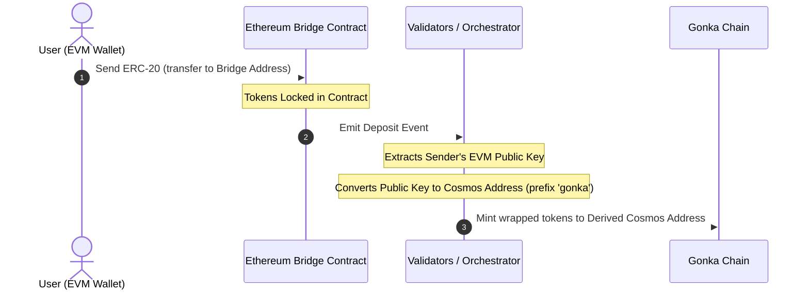
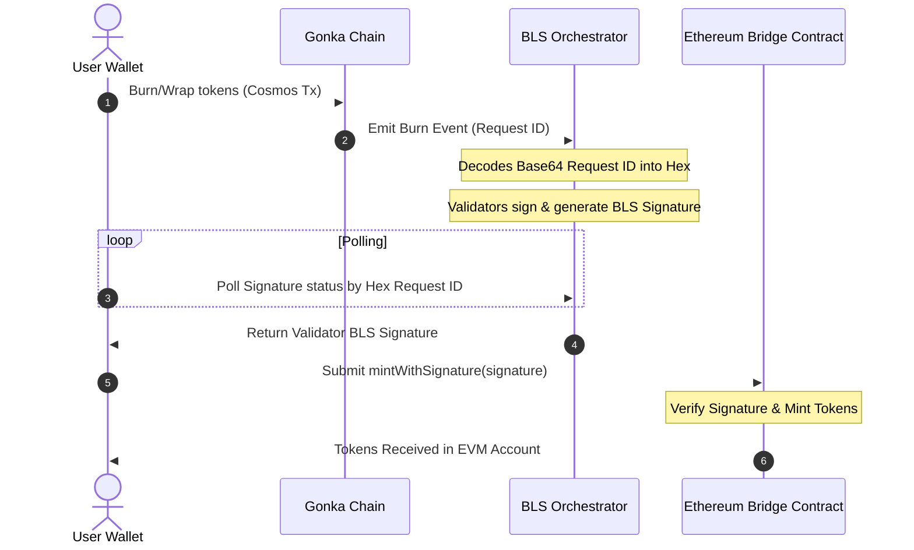

# Technical Integration Guide: Exchange & Bridge Widget

This guide provides technical specifications, architectural designs, and implementation steps for community developers who want to recreate the Exchange & Bridge Widget within their own custom dashboards.

---

## 1. Architectural Overview

To prevent structural confusion, the asset flows for deposits and withdrawals are split into two separate, independent processes.

### A. Deposit Flow (EVM to Gonka) & Address Derivation
During a deposit, tokens are locked on Ethereum, and equivalent wrapped tokens are minted on Gonka based on the derived Cosmos address of the sender's EVM public key. This is where address derivation mismatches can occur:



### B. Withdraw / Unwrap Flow (Gonka to EVM)
During a withdrawal, tokens are burned on the Cosmos side, validator BLS signatures are polled, and then claimed (minted) on the Ethereum side:



---

## 2. Deposit Functionality

### A. IBC Deposits (Cosmos to Gonka)
IBC deposits transfer assets directly from Cosmos source chains (e.g. Osmosis, Cosmos Hub, Injective) to Gonka.

1. **Enable & Connect Source Chain**: Query Keplr for the source chain credentials.
    ```typescript
    async function connectSourceChain(chainId: string) {
      const walletProvider = (window as any).keplr;
      if (!walletProvider) throw new Error("Cosmos wallet extension not found.");
      
      await walletProvider.enable(chainId);
      const offlineSigner = walletProvider.getOfflineSigner(chainId);
      const accounts = await offlineSigner.getAccounts();
      return { address: accounts[0].address, offlineSigner };
    }
    ```

2. **Resolve Channel Routing**: Query the Gonka RPC channel metadata (`/ibc/core/channel/v1/channels`) to resolve counterparty paths.
    ```typescript
    async function resolveIbcChannel(nodeUrl: string, targetChainId: string): Promise<string | null> {
      const response = await fetch(`${nodeUrl}/ibc/core/channel/v1/channels`).then(r => r.json());
      const channels = response?.channels || [];

      for (const channel of channels) {
        if (channel.state !== 'STATE_OPEN' || channel.port_id !== 'transfer') continue;

        const clientData = await fetch(
          `${nodeUrl}/ibc/core/channel/v1/channels/${channel.channel_id}/ports/transfer/client_state`
        ).then(r => r.json());
        
        const clientChainId = clientData?.identified_client_state?.client_state?.chain_id || 
                              clientData?.client_state?.chain_id;

        if (clientChainId === targetChainId) {
          return channel.counterparty?.channel_id || null;
        }
      }
      return null;
    }
    ```

3. **Execute IBC Transfer**: Dispatch a standard CosmJS `MsgTransfer` from the source chain.
    ```typescript
    import { SigningStargateClient } from '@cosmjs/stargate';

    async function initiateIbcDeposit(
      sourceChainId: string,
      sourcePort: string,    // e.g., 'transfer'
      sourceChannel: string, // e.g., 'channel-0'
      denom: string,         // e.g., 'uusdt'
      amount: string,        // In base units
      senderSourceAddress: string,
      receiverGonkaAddress: string,
      offlineSigner: any,
      rpcUrl: string
    ) {
      const client = await SigningStargateClient.connectWithSigner(rpcUrl, offlineSigner);
      
      const timeoutTimestamp = (BigInt(Date.now()) + 600_000n) * 1_000_000n; // 10 minutes timeout in nanoseconds

      const response = await client.sendIbcTokens(
        senderSourceAddress,  // Sender on source chain (e.g. Osmosis address)
        receiverGonkaAddress, // Receiver on Gonka chain
        { denom, amount },
        sourcePort,
        sourceChannel,
        undefined, // timeoutHeight
        Number(timeoutTimestamp) / 1_000_000_000, // timeoutTimestamp in seconds
        { amount: [], gas: '200000' } // Fee
      );
      
      return response.transactionHash;
    }
    ```

### B. EVM Bridge Deposits (EVM to Gonka)
EVM deposits involve locking ERC-20 assets on an EVM source chain to mint corresponding tokens on Gonka. The transaction flow requires the following steps:

1. **Verify EVM Address Key-Mismatch**: Validate that the active EVM address derives a Cosmos address matching the connected Keplr public key.
   
    > **WARNING: EVM Address Key-Mismatch**  
    > When a user is connected via a standard software mnemonic seed phrase, their EVM wallet (MetaMask) derives addresses using coin type `60` while their Cosmos wallet (Keplr) derives addresses using coin type `118` or `1200`. 
    > * Because these derivation paths are different, their EVM public key and Cosmos public key do **not** match.
    > * The Ethereum bridge contract catches the public key of the depositing EVM address and mints tokens on Gonka to the Bech32 address derived **directly from that EVM public key**.
    > * If a mnemonic-derived mismatch occurs, the tokens will be minted to a completely **different** Cosmos address than their active Keplr wallet. The funds are not permanently lost — the user can still derive the Ethereum private key from their mnemonic (coin type `60`) and use it to access the receiving Gonka account — but this requires a manual key derivation step that most users won't expect.

    **The Solution: Key Verification Checklist**  
    Before allowing a user to deposit, perform this validation:

    ```typescript
    import { toBech32 } from '@cosmjs/encoding';
    import { ethers } from 'ethers';

    async function verifyAddressMismatch(
      activeEvmAddress: string,
      cosmosChainId: string,
      currentCosmosAddress: string,
      bech32Prefix: string = 'gonka'
    ) {
      // 1. Resolve active wallet provider (Keplr)
      const walletProvider = (window as any).keplr;
      if (!walletProvider) return { isMismatch: false };

      // 2. Fetch key properties from Cosmos wallet
      const key = await walletProvider.getKey(cosmosChainId);
      const pubKeyBytes = key.pubKey;
      if (!pubKeyBytes || pubKeyBytes.length === 0) {
        console.warn("Public key not available from provider.");
        return { isMismatch: false };
      }

      // 3. Derive the REAL Ethereum address from the Cosmos public key (keccak256-based)
      // NOTE: key.ethereumHexAddress is NOT the real EVM address — it is just the Cosmos 
      // address bytes (sha256+ripemd160) represented as hex, which will mismatch.
      const pubKeyHex = '0x' + Array.from(pubKeyBytes, (b) => b.toString(16).padStart(2, '0')).join('');
      const derivedEvmAddress = ethers.computeAddress(pubKeyHex);

      // 4. Compare active EVM address with derived EVM address
      const isMismatch = activeEvmAddress.toLowerCase() !== derivedEvmAddress.toLowerCase();

      if (isMismatch) {
        // 5. Derive where the tokens will land by decoding EVM hex and encoding as Bech32
        const rawHex = activeEvmAddress.startsWith('0x') ? activeEvmAddress.substring(2) : activeEvmAddress;
        const hexBytes = new Uint8Array(
          rawHex.match(/.{1,2}/g)?.map((byte: string) => parseInt(byte, 16)) || []
        );
        const targetCosmosAddress = toBech32(bech32Prefix, hexBytes);

        return {
          isMismatch: true,
          targetCosmosAddress,      // Tokens will mint here
          expectedEvmAddress: derivedEvmAddress // User must switch EVM wallet to this address
        };
      }

      return { isMismatch: false };
    }
    ```

2. **Resolve Bridge Contract Address**: Fetch the approved bridge contract address for the target token from the registry API.
    ```typescript
    async function resolveBridgeAddress(nodeUrl: string, chainId: string): Promise<string> {
      const response = await fetch(
        `${nodeUrl}/productscience/inference/inference/bridge_addresses/${chainId}`
      ).then(r => r.json());
      
      const address = response?.bridge_address || response?.address || response?.approved_bridge_address;
      if (!address) {
        throw new Error(`Failed to resolve bridge address for chain: ${chainId}`);
      }
      return address;
    }
    ```

3. **Switch EVM Network**: Verify and request a switch (`wallet_switchEthereumChain`) to the correct Ethereum network (Mainnet or Sepolia Testnet).
    ```typescript
    async function switchEvmNetwork(ethProvider: any, isTestnet: boolean) {
      const targetChainIdHex = isTestnet ? '0xaa36a7' : '0x1'; // Sepolia or Mainnet
      try {
        await ethProvider.request({
          method: 'wallet_switchEthereumChain',
          params: [{ chainId: targetChainIdHex }],
        });
      } catch (switchError: any) {
        if (switchError.code === 4902) {
          throw new Error(`Please add the ${isTestnet ? 'Sepolia' : 'Ethereum'} network to your EVM wallet first.`);
        }
        throw switchError;
      }
    }
    ```

4. **Execute ERC-20 Transfer**: Generate the ERC-20 `transfer(bridgeAddress, amount)` ABI call payload and dispatch it to the ERC-20 token contract address via the EVM provider.

    > **WARNING:**  
    > When depositing ERC-20 tokens, do **not** send a raw transaction directly to the bridge contract address. Instead, you must target the **ERC-20 token contract address** as the recipient (`to`), and pass the encoded data payload representing the `transfer(bridgeContractAddress, amount)` function call.

    ```typescript
    // 1. Manually encode the ERC-20 transfer(address to, uint256 value) function call
    // Method selector for transfer(address,uint256) is 0xa9059cbb
    const methodId = '0xa9059cbb';
    const toPadding = bridgeContractAddress.replace(/^0x/i, '').padStart(64, '0');
    const amountHex = amountInBaseUnits.toString(16).padStart(64, '0');
    const data = methodId + toPadding + amountHex;

    // 2. Dispatch transaction targeting the ERC-20 Token Contract address
    // (Resolves either Keplr's injected EVM provider or standard window.ethereum)
    const ethProvider = (window as any).keplr?.ethereum || (window as any).ethereum;
    if (!ethProvider) throw new Error("No EVM provider found.");

    await ethProvider.request({
      method: 'eth_sendTransaction',
      params: [{
        from: activeEvmAddress,
        to: erc20ContractAddress, // Target the ERC-20 contract
        data: data                // Encoded call to transfer tokens to bridgeContractAddress
      }],
    });
    ```

---

## 3. Withdrawal Functionality

### A. IBC Withdrawals (Gonka to Cosmos)
IBC withdrawals transfer assets directly from Gonka back to Cosmos destination chains (e.g. Osmosis, Cosmos Hub, Injective).

1. **Resolve Local Channel**: Query the Gonka RPC channel list metadata (`/ibc/core/channel/v1/channels`) to resolve the channel targeting the destination chain.
2. **Execute IBC Transfer**: Dispatch a standard CosmJS `MsgTransfer` on the Gonka chain.

    ```typescript
    import { SigningStargateClient } from '@cosmjs/stargate';

    async function initiateIbcWithdraw(
      gonkaChainId: string,
      localChannel: string,   // e.g., 'channel-0'
      denom: string,          // e.g., 'ibc/...' or native denom
      amount: string,         // In base units
      senderGonkaAddress: string,
      receiverCosmosAddress: string,
      offlineSigner: any,
      rpcUrl: string
    ) {
      const client = await SigningStargateClient.connectWithSigner(rpcUrl, offlineSigner);
      
      const timeoutTimestamp = (BigInt(Date.now()) + 600_000n) * 1_000_000n; // 10 minutes timeout in nanoseconds

      const response = await client.sendIbcTokens(
        senderGonkaAddress,    // Sender on Gonka chain
        receiverCosmosAddress, // Receiver on destination chain
        { denom, amount },
        'transfer',
        localChannel,
        undefined, // timeoutHeight
        Number(timeoutTimestamp) / 1_000_000_000, // timeoutTimestamp in seconds
        { amount: [], gas: '200000' } // Fee
      );
      
      return response.transactionHash;
    }
    ```

---

### B. EVM Bridge Withdrawals (Multi-Stage Unwrap)
Unwrapping tokens out of Gonka back to Ethereum is an asynchronous process consisting of three distinct steps, which must be preceded by a critical validation check:

#### Prerequisite: Bridge Epoch Synced Validation
To guarantee withdrawals are processed successfully, verify that the Ethereum bridge contract epoch is in sync with the current Gonka chain epoch *before* starting the unwrap transaction flow. If the bridge is behind, you must prompt the user to register missing epochs on the bridge contract.

```typescript
import { ethers } from 'ethers';

const BRIDGE_ABI = [
  'function getLatestEpochInfo() view returns (uint64 epochId, uint64 timestamp, bytes groupKey)',
  'function getCurrentState() view returns (uint8)',
  'function isValidEpoch(uint64 epochId) view returns (bool)',
  'function submitGroupKey(uint64 epochId, bytes groupPublicKey, bytes validationSig) external',
];

// 1. Fetch current bridge epoch status
async function checkBridgeEpochStatus(
  bridgeAddress: string,
  chainEpoch: number,
  ethProvider: any
): Promise<{ isSynced: boolean; bridgeEpoch: number }> {
  const provider = new ethers.BrowserProvider(ethProvider);
  const contract = new ethers.Contract(bridgeAddress, BRIDGE_ABI, provider);

  const latestInfo = await contract.getLatestEpochInfo();
  const bridgeEpoch = Number(latestInfo.epochId);

  return {
    bridgeEpoch,
    isSynced: bridgeEpoch >= chainEpoch,
  };
}

// 2. Fetch missing BLS epoch registration data from Orchestrator API
async function fetchEpochBLSData(orchestratorUrl: string, epochId: number) {
  const data = await fetch(`${orchestratorUrl}/bls/epochs/${epochId}`).then(r => r.json());
  
  // Helper to convert base64 to hex
  const base64ToHex = (b64: string) => {
    const bytes = Uint8Array.from(atob(b64), c => c.charCodeAt(0));
    return '0x' + Array.from(bytes).map(b => b.toString(16).padStart(2, '0')).join('');
  };

  return {
    groupPublicKeyHex: base64ToHex(data.group_public_key_uncompressed_256),
    validationSignatureHex: base64ToHex(data.validation_signature_uncompressed_128),
  };
}

// 3. Sequentially register missing epochs on the Ethereum Bridge
async function syncMissingEpochs(
  bridgeAddress: string,
  targetEpochId: number,
  orchestratorUrl: string,
  ethProvider: any
) {
  const provider = new ethers.BrowserProvider(ethProvider);
  const signer = await provider.getSigner();
  const contract = new ethers.Contract(bridgeAddress, BRIDGE_ABI, signer);

  // Check if target epoch is already valid
  const isValid = await contract.isValidEpoch(targetEpochId);
  if (isValid) return;

  const latestInfo = await contract.getLatestEpochInfo();
  const latestContractEpoch = Number(latestInfo.epochId);

  // Sequentially submit group keys for each missing epoch
  for (let epoch = latestContractEpoch + 1; epoch <= targetEpochId; epoch++) {
    const epochData = await fetchEpochBLSData(orchestratorUrl, epoch);
    const tx = await contract.submitGroupKey(
      epoch,
      epochData.groupPublicKeyHex,
      epochData.validationSignatureHex
    );
    await tx.wait();
  }
}
```

If the bridge is behind (`chainEpoch > bridgeEpoch`), the user should be prompted to trigger the sequential epoch sync (`syncMissingEpochs`) before they are allowed to proceed with Stage 1 (burning assets).

---

#### Stage 1: Burn/Wrap Tokens on Gonka
Execute a Cosmos SDK transaction to request a bridge unwrap. This is either a standard CW-20 contract execute message (burning/unwrapping wrapped tokens) or a custom native bridge unwrap transaction type (unwrapping native GNK to WGNK).

##### **A. Custom Registry Setup**

If you are using a custom registry to sign custom message types (like `MsgRequestBridgeMint`), you **must** register standard CosmWasm types as well (such as `wasmTypes` containing `/cosmwasm.wasm.v1.MsgExecuteContract`). Failure to do so will result in an "Unregistered type URL" error during CW-20 transactions.

```typescript
import { Registry } from '@cosmjs/proto-signing';
import { defaultRegistryTypes } from '@cosmjs/stargate';
import { wasmTypes } from '@cosmjs/cosmwasm-stargate';

// Custom bridge burn / unwrap Msg type registration (for native GNK -> WGNK unwrap)
export const MsgRequestBridgeMintType = {
  typeUrl: '/inference.inference.MsgRequestBridgeMint',
  create(message: any) { return message; },
  fromPartial(message: any) { return message; },
  encode(message: any, writer: any) {
    // Requires standard fields: creator, amount, destinationAddress, chainId, destinationBridgeAddress
    return writer;
  },
  decode() { return {}; }
};

const customRegistry = new Registry([
  ...defaultRegistryTypes,
  ...wasmTypes, // Crucial for /cosmwasm.wasm.v1.MsgExecuteContract
  ['/inference.inference.MsgRequestBridgeMint', MsgRequestBridgeMintType as any]
]);
```

##### **B. Message Construction**
Depending on the asset being unwrapped, construct either a native unwrap message or a CW-20 execute message:

```typescript
// 1. For Native GNK -> WGNK:
const msg = {
  typeUrl: '/inference.inference.MsgRequestBridgeMint',
  value: {
    creator: senderAddress,
    amount: amountInBaseUnits,
    destinationAddress: recipientEthAddress,
    chainId: 'ethereum',
    destinationBridgeAddress: bridgeContractAddress,
  },
};

// 2. For CW-20 Wrapped Tokens (e.g. USDT, USDC):
const withdrawMsg = {
  withdraw: {
    amount: amountInBaseUnits,
    destination_bridge_address: bridgeContractAddress,
    destination_address: recipientEthAddress,
  },
};

const msg = {
  typeUrl: '/cosmwasm.wasm.v1.MsgExecuteContract',
  value: {
    sender: senderAddress,
    contract: cw20ContractAddress,
    msg: new TextEncoder().encode(JSON.stringify(withdrawMsg)),
    funds: [],
  },
};
```

##### **C. Local Tx Hash Calculation & Indexer Fallback**
On Cosmos nodes where transaction indexing is disabled (`tx_index = "off"`), broadcasting a transaction via `client.broadcastTx()` may throw a `transaction indexing is disabled` error even though the transaction is committed successfully. 

To support these nodes, sign the transaction manually, pre-generate the transaction hash locally (via SHA-256 of the signed `TxRaw` bytes), and capture the indexer error:

```typescript
import { toHex } from '@cosmjs/encoding';
import { sha256 } from '@cosmjs/crypto';
import { TxRaw } from 'cosmjs-types/cosmos/tx/v1beta1/tx';

async function signAndBroadcastWithIndexerFallback(
  client: SigningCosmWasmClient,
  senderAddress: string,
  messages: any[]
): Promise<{ transactionHash: string; hasEvents: boolean }> {
  // Sign manually using customRegistry
  const txRaw = await client.sign(senderAddress, messages, 'auto', '');
  const txBytes = TxRaw.encode(txRaw).finish();
  
  // Pre-calculate Tx Hash (SHA-256)
  const txHash = toHex(sha256(txBytes)).toUpperCase();

  try {
    const result = await client.broadcastTx(txBytes);
    return { transactionHash: result.transactionHash, hasEvents: true };
  } catch (error: any) {
    if (error.message.includes('transaction indexing is disabled')) {
      // The transaction was broadcast successfully, but the node will not return events
      return { transactionHash: txHash, hasEvents: false };
    }
    throw error;
  }
}
```

---

#### Stage 2: Resolution of Request IDs & BLS Signature Polling
When the burn transaction completes on Gonka, you need to extract the `request_id` and `epoch_id` to poll the validators' signatures.

##### **A. Fetching Request Details (Event-based vs. History Fallback)**
If the RPC node has transaction indexing enabled, you can read the `request_id` directly from the transaction events. Otherwise, you must query the orchestrator's state history endpoint to look up the request.

```typescript
// 1. Event-based Resolution (Indexing Enabled)
function parseUnwrapEvents(txResult: any): { requestId: string; epochId: number } {
  const blsEvent = txResult.events?.find((e: any) => e.type.includes('EventThresholdSigningRequested'));
  if (!blsEvent) throw new Error('BLS signing request event not found.');

  const getAttr = (key: string) => blsEvent.attributes.find((a: any) => a.key === key).value.replace(/^"|"$/g, '');
  return {
    requestId: getAttr('request_id'),
    epochId: parseInt(getAttr('current_epoch_id'), 10),
  };
}

// 2. State History Fallback (Indexing Disabled / tx_index = "off")
// Query the Cosmos node's state history registry: `GET {nodeUrl}/productscience/inference/bls/signing_history?pagination.limit=100&pagination.reverse=true`
// 
// Example Response:
// {
//   "signing_requests": [
//     {
//       "request_id": "9/Pl3Hztt0KrZTMOQvXv87lNSM+SC4wjuUbJbZU3z8Y=",
//       "current_epoch_id": "287",
//       "status": "THRESHOLD_SIGNING_STATUS_COMPLETED",
//       "created_block_height": "4438273",
//       "data": [
//         "AAAAAAAAAAAAAAAAAAAAAAAAAAAAAAAAAAAAAAAAAAE=",
//         "CsXlVAEeF4b1Bz8kMHvW1ii+NAmDSyqIoH38Wvmzcu4="
//       ]
//     }
//   ]
// }
async function resolveRequestFromHistory(
  nodeUrl: string,
  recipientEthAddress: string,
  amount: string
): Promise<{ requestId: string; epochId: number }> {
  // Convert EVM hex address to Base64 (orchestrator storage format)
  const recipientHex = recipientEthAddress.toLowerCase().replace(/^0x/, '');
  const bytes = new Uint8Array(recipientHex.length / 2);
  for (let i = 0; i < bytes.length; i++) {
    bytes[i] = parseInt(recipientHex.substring(i * 2, i * 2 + 2), 16);
  }
  const recipientB64 = btoa(String.fromCharCode(...Array.from(bytes)));

  // Query signing history registry
  const url = `${nodeUrl}/productscience/inference/bls/signing_history?pagination.limit=100&pagination.reverse=true`;
  const res = await fetch(url).then(r => r.json());
  const requests = res.signing_requests || [];

  // Match recipient and amount
  const matches = requests.filter((r: any) => r.data && r.data.some((d: string) => d === recipientB64));
  if (matches.length === 0) throw new Error('Transaction not found in signing history');

  // Sort descending by block height to get the latest
  matches.sort((a: any, b: any) => parseInt(b.created_block_height) - parseInt(a.created_block_height));
  const matched = matches[0];

  // Convert Base64 request_id to hex
  const reqIdBytes = Uint8Array.from(atob(matched.request_id), c => c.charCodeAt(0));
  const reqIdHex = '0x' + Array.from(reqIdBytes).map(b => b.toString(16).padStart(2, '0')).join('');

  return {
    requestId: reqIdHex,
    epochId: parseInt(matched.current_epoch_id, 10),
  };
}
```

##### **B. BLS Signature Polling**
> **IMPORTANT:**  
> **Base64 to Hex Translation**:  
> If you resolved the `request_id` via event attributes (Base64-encoded, e.g. `YIDIsA...`), you **must** decode the Base64 string directly to bytes, and then represent them as a **32-byte Hexadecimal string** (e.g., `0x6080c8...`). Do **not** apply hashing functions like Keccak256 or SHA-256 to the Base64 string.

```typescript
function base64ToHex(base64Str: string): string {
  const binary = atob(base64Str);
  const bytes = new Uint8Array(binary.length);
  for (let i = 0; i < binary.length; i++) {
    bytes[i] = binary.charCodeAt(i);
  }
  return '0x' + Array.from(bytes).map(b => b.toString(16).padStart(2, '0')).join('');
}
```

Poll the BLS signatures endpoint (`{orchestratorUrl}/bls/signatures/{hexRequestId}`) until a valid signature is generated by validators.

**Example Response**:
```json
{
  "signing_request": {
    "request_id": "9/Pl3Hztt0KrZTMOQvXv87lNSM+SC4wjuUbJbZU3z8Y=",
    "current_epoch_id": 287,
    "status": 3
  },
  "uncompressed_signature_128": "AAAAAAAAAAAAAAAAAAAAABii5ArDtPtnmRw87QXJJRLlMohL3+fEWhuVKJqrh..."
}
```

```typescript
// Watch out for backend enum representations (integers vs strings)
// e.g. status 3 or 'THRESHOLD_SIGNING_STATUS_COMPLETED' represents success
const COMPLETED_STATUSES = new Set([3, '3', 'THRESHOLD_SIGNING_STATUS_COMPLETED']);
const FAILED_STATUSES = new Set([4, '4', 'THRESHOLD_SIGNING_STATUS_FAILED']);

async function pollBlsSignature(orchestratorUrl: string, hexRequestId: string): Promise<string> {
  const url = `${orchestratorUrl}/bls/signatures/${hexRequestId.replace(/^0x/, '')}`;
  
  while (true) {
    const data = await fetch(url).then(r => r.json());
    const status = data?.signing_request?.status;
    
    if (COMPLETED_STATUSES.has(status)) {
      const sigBase64 = data?.uncompressed_signature_128;
      if (!sigBase64) {
        throw new Error('Signature completed but uncompressed_signature_128 is missing.');
      }
      
      // Convert 128-byte Base64 signature to Hex format for EVM submission
      const sigBytes = Uint8Array.from(atob(sigBase64), c => c.charCodeAt(0));
      const sigHex = '0x' + Array.from(sigBytes).map(b => b.toString(16).padStart(2, '0')).join('');
      return sigHex;
    }
    
    if (FAILED_STATUSES.has(status)) {
      throw new Error('BLS signature generation failed.');
    }
    
    await new Promise(resolve => setTimeout(resolve, 3000)); // Poll every 3 seconds
  }
}
```

#### Stage 3: Mint on Ethereum Contract
Call `mintWithSignature` on the Ethereum bridge contract, submitting the validators' signature data.

```typescript
import { ethers } from 'ethers';

const BRIDGE_ABI = [
  'function withdraw((uint64 epochId, bytes32 requestId, address recipient, address tokenContract, uint256 amount, bytes signature) cmd) external',
  'function mintWithSignature((uint64 epochId, bytes32 requestId, address recipient, uint256 amount, bytes signature) cmd) external',
];

async function mintOnEthereum(
  ethProvider: any,
  bridgeAddress: string,
  mintParams: {
    epochId: number;
    requestId: string; // 32-byte hex string (0x...)
    recipient: string;
    amount: string;
    signature: string; // 128-byte hex signature
    tokenContract?: string; // Required for ERC-20 unwraps
    isNativeGNK?: boolean;
  }
) {
  const provider = new ethers.BrowserProvider(ethProvider);
  const signer = await provider.getSigner();
  const contract = new ethers.Contract(bridgeAddress, BRIDGE_ABI, signer);

  let tx;
  if (mintParams.isNativeGNK) {
    const cmd = {
      epochId: mintParams.epochId,
      requestId: mintParams.requestId,
      recipient: mintParams.recipient,
      amount: mintParams.amount,
      signature: mintParams.signature,
    };
    tx = await contract.mintWithSignature(cmd);
  } else {
    const cmd = {
      epochId: mintParams.epochId,
      requestId: mintParams.requestId,
      recipient: mintParams.recipient,
      tokenContract: mintParams.tokenContract,
      amount: mintParams.amount,
      signature: mintParams.signature,
    };
    tx = await contract.withdraw(cmd);
  }

  const receipt = await tx.wait();
  if (!receipt || receipt.status === 0) {
    throw new Error('Transaction reverted on-chain');
  }
  return receipt.hash;
}
```

---

## 4. Resilience Recovery System (Resume/Cache) (Recommended / Optional)

To prevent users from losing their transaction state in case of a browser crash, network disconnection, or tab closure, it is highly recommended (though optional) to implement a **Resilience Caching Pattern**:

1. **Write to cache** immediately before broadcasting Stage 1:
    ```typescript
    const cacheKey = `pending_unwrap_${userCosmosAddress}`;
    localStorage.setItem(cacheKey, JSON.stringify({
      status: 'burning',
      gonkaTxHash: '',
      amount: amountInBaseUnits,
      destinationEthAddress,
      step: 1
    }));
    ```
2. **Update cache** when Gonka TX is broadcasting, and when `request_id` is resolved.
3. **On Mount**: Check if `localStorage.getItem(cacheKey)` exists. If found, display a **"Pending Transaction Detected"** card allowing the user to either:
    * **Resume Transaction**: Restores states and directly jumps to Stage 2 (Polling BLS Signatures) or Stage 3 (EVM Minting).
    * **Discard**: Clears the `localStorage` key.

---
## 5. Token List Resolution & Metadata Gathering

To ensure a seamless user experience, the widget dynamically queries and resolves available assets and their metadata (symbols, decimals) from both the Cosmos and Ethereum chains.

### A. Deposit Token List (`allDepositTokens`)

The deposit drop-down displays the list of assets the user can bridge *onto* Gonka. This list is constructed by merging and resolving metadata for approved tokens and WGNK:

* **Approved Tokens Registry**: Retrieve the list of tradeable/bridgeable tokens from the backend registry: `GET {nodeUrl}/productscience/inference/inference/approved_tokens_for_trade`.
* **Dynamic WGNK Injection**: Retrieve the current bridge contract address (`GET {nodeUrl}/productscience/inference/inference/bridge_addresses/ethereum`). If the resolved bridge contract address (WGNK) is not present in the approved tokens list, dynamically append `WGNK` (with 9 decimals) to allow users to wrap native GNK.
* **Symbol & Decimal Resolution**:
    * **Cosmos (IBC)**: Matches assets against an offline metadata map or queries the Cosmos chain bank metadata: `GET {nodeUrl}/cosmos/bank/v1beta1/denoms_metadata/{denom}`.
    * **Ethereum (Bridge)**: Queries public EVM RPC nodes via raw `eth_call` actions (`0x95d89b41` for `symbol()` and `0x313ce567` for `decimals()`).

#### Implementation Example
```typescript
// Inject WGNK dynamically if missing from the approved tokens list
const allDepositTokens = computed(() => {
  const list = [...supportedIbcTokens.value, ...supportedEthTokens.value];
  if (resolvedBridgeAddress.value && resolvedBridgeAddress.value.startsWith('0x')) {
    const hasWgnk = list.some(
      t => t.symbol === 'WGNK' || 
      String(t.contractAddress).toLowerCase() === resolvedBridgeAddress.value.toLowerCase()
    );
    if (!hasWgnk) {
      list.push({
        chainId: 'ethereum',
        contractAddress: resolvedBridgeAddress.value,
        symbol: 'WGNK',
        decimals: 9,
        type: 'eth',
      });
    }
  }
  return list;
});

// Direct ERC-20 metadata queries via JSON-RPC eth_call
async function queryEvmRpc(to: string, data: string, rpcUrl: string): Promise<string> {
  const response = await fetch(rpcUrl, {
    method: 'POST',
    headers: { 'Content-Type': 'application/json' },
    body: JSON.stringify({
      jsonrpc: '2.0',
      method: 'eth_call',
      params: [{ to, data }, 'latest'],
      id: 1
    })
  }).then(r => r.json());
  return response?.result || '0x';
}

// Parsing ERC-20 Symbol name from hex string
function parseBytes32OrString(hex: string): string {
  if (!hex || hex === '0x') return '';
  const clean = hex.replace(/^0x/i, '');
  if (clean.length < 64) return '';

  const offset = parseInt(clean.substring(0, 64), 16);
  if (offset === 32 && clean.length >= 128) {
    const length = parseInt(clean.substring(64, 128), 16);
    if (length > 0 && length <= 1000) {
      const dataHex = clean.substring(128, 128 + length * 2);
      let str = '';
      for (let i = 0; i < dataHex.length; i += 2) {
        const charCode = parseInt(dataHex.substring(i, i + 2), 16);
        if (charCode >= 32 && charCode <= 126) {
          str += String.fromCharCode(charCode);
        }
      }
      return str.trim();
    }
  }
  return '';
}
```

---

### B. Withdrawal Token List (`withdrawableTokens`)

The withdrawal drop-down displays the list of assets in the user's wallet that can be bridged *out* of Gonka. Constructing this list requires combining three sub-actions to merge different token sources:

* **Cosmos Wrapped Balances (CW-20)**: Query the user's CW-20 wrapped token balances on the Gonka chain via the REST API endpoint `GET {nodeUrl}/productscience/inference/inference/wrapped_token_balances/{walletAddress}`.
  
  **Example Response**:
  ```json
  {
    "balances": [
      {
        "token_info": {
          "chainId": "ethereum",
          "contractAddress": "0xa0b86991c6218b36c1d19d4a2e9eb0ce3606eb48",
          "wrappedContractAddress": "gonka1fa83z7np903k9vh63guy82qthtv373d7vjeq0y7xeqh50rzn8vtssffkre"
        },
        "symbol": "USDC",
        "balance": "15000000",
        "decimals": "6",
        "formatted_balance": "15.0"
      }
    ]
  }
  ```

!!! tip "Optional Recommendation: Dynamic Contract Discovery & Caching"
    If you want to dynamically discover all wrapped token contracts deployed on the Gonka chain, you can query all contract addresses deployed under the wrapped token code ID `105`:
    
    `GET {nodeUrl}/cosmwasm/wasm/v1/code/105/contracts`
    
    **Example Response**:
    ```json
    {
      "contracts": [
        "gonka1fa83z7np903k9vh63guy82qthtv373d7vjeq0y7xeqh50rzn8vtssffkre",
        "gonka15ggwj9un6qrmu4nj5ev6l7kpdcr00td03ff2mmj4cyhl8u8vjd2qnl3hgk"
      ],
      "pagination": { "next_key": null, "total": "0" }
    }
    ```
    
    To fetch the metadata (symbol, name, decimals) for each contract address, perform a smart contract query for `token_info`:
    
    `GET {nodeUrl}/cosmwasm/wasm/v1/contract/{contractAddress}/smart/eyJ0b2tlbl9pbmZvIjp7fX0=`
    *(where `eyJ0b2tlbl9pbmZvIjp7fX0=` is the Base64 encoding of `{"token_info":{}}`)*
    
    **Example Response**:
    ```json
    {
      "data": {
        "name": "USD Coin",
        "symbol": "USDC",
        "decimals": 6,
        "total_supply": "1400000"
      }
    }
    ```
    
    To optimize widget performance and avoid repetitive on-chain smart queries, we highly recommend caching this contract metadata locally.
* **Cosmos Native IBC Balances**: Query standard bank balances using the bank module REST API: `GET {nodeUrl}/cosmos/bank/v1beta1/balances/{address}`.
  
  **Example Response**:
  ```json
  {
    "balances": [
      {
        "denom": "ngonka",
        "amount": "1000000000"
      },
      {
        "denom": "ibc/ED07A3391A112B175915CD8FAF43A2153E30D7181A2E45558B93F44C2754781B",
        "amount": "5000000"
      }
    ],
    "pagination": { "next_key": null, "total": "2" }
  }
  ```
* **Dynamic GNK Injection**: Retrieve the user's native GNK (staking token) balance. If it exists, inject it dynamically into the list of withdrawable tokens (mapped as an unwrap action to the Ethereum bridge) so they can unwrap GNK back to WGNK.

#### Implementation Example
To construct the final withdrawable tokens list, fetch the balances and merge them together:

```typescript
async function getWrappedTokenBalances(nodeUrl: string, walletAddress: string) {
  const response = await fetch(`${nodeUrl}/productscience/inference/inference/wrapped_token_balances/${walletAddress}`);
  const data = await response.json();
  return data?.balances || [];
}

async function getIbcBalances(nodeUrl: string, walletAddress: string, ibcDenom: string) {
  const balUrl = `${nodeUrl}/cosmos/bank/v1beta1/balances/${walletAddress}/by_denom?denom=${encodeURIComponent(ibcDenom)}`;
  const response = await fetch(balUrl);
  const data = await response.json();
  return data?.balance?.amount || '0';
}

// Combine wrapped balances with native GNK token staking balances for unwrap
const withdrawableTokens = computed(() => {
  const list = [...wrappedTokenBalances.value]; // Contains both native IBC balances & CW20 wrapped balances
  if (walletAddress.value) {
    const gnkBalance = walletStore.balanceOfStakingToken;
    const gnkAmt = parseFloat(gnkBalance.amount || '0') / 1_000_000_000;
    const hasGnk = list.some(t => t.symbol === 'GNK');
    if (!hasGnk && gnkAmt > 0) {
      list.unshift({
        symbol: 'GNK',
        full_denom: gnkBalance.denom,
        formatted_balance: gnkAmt.toString(),
        decimals: 9,
        isNative: false,
        isGnk: true,
        token_info: {
          chainId: 'ethereum',
          contractAddress: '', // mapped dynamically to bridge contract
        }
      });
    }
  }
  return list;
});
```
