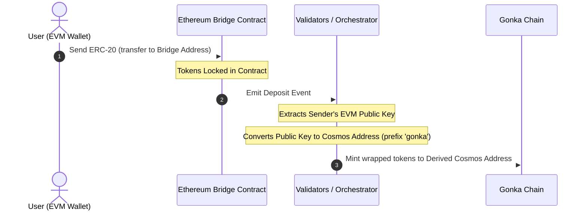
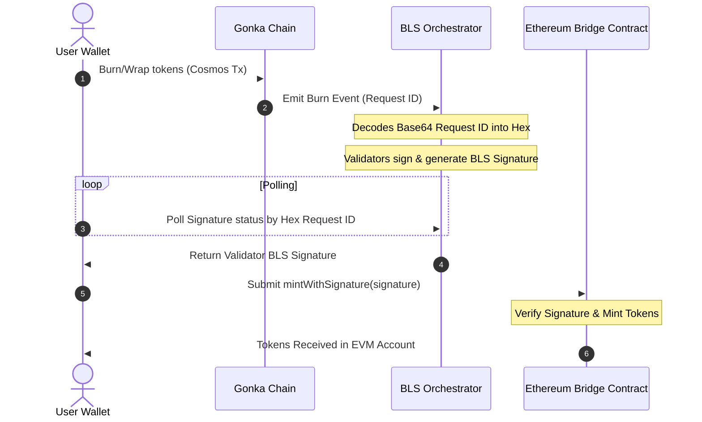

# 技术集成指南：兑换与跨链桥小部件

本指南为社区开发者提供了技术规范、架构设计以及实现步骤，用于在自定义仪表板中重新创建“兑换与跨链桥小部件”。

---

## 1. 架构概述

为避免结构混乱，存款和取款的资产流向被划分为两个独立且分离的流程。

### A. 存款流程（EVM 到 Gonka）与地址推导
在存款过程中，代币将被锁定在以太坊上，同时根据发送方 EVM 公钥推导出的 Cosmos 地址，在 Gonka 链上铸造等值的封装代币。此过程可能出现地址推导不一致的问题：



### B. 提现 / 解封装流程（Gonka 到 EVM）
在提现过程中，代币会在 Cosmos 端被销毁，然后收集验证者的 BLS 签名，最后在以太坊端进行申领（即铸币）：



---

## 2. 存款功能

### A. IBC 存款（从 Cosmos 到 Gonka）
IBC 存款通过 IBC 协议将资产直接从 Cosmos 源链（例如 Osmosis、Cosmos Hub、Injective）转移到 Gonka。

1. **启用并连接源链**：向 Keplr 查询源链的凭证。

```typescript
async function connectSourceChain(chainId: string) {
  const walletProvider = (window as any).keplr;
  if (!walletProvider) throw new Error("Cosmos wallet extension not found.");
  
  await walletProvider.enable(chainId);
  const offlineSigner = walletProvider.getOfflineSigner(chainId);
  const accounts = await offlineSigner.getAccounts();
  return { address: accounts[0].address, offlineSigner };
}
```

2. **解决通道路由**：查询 Gonka RPC 通道元数据（`/ibc/core/channel/v1/channels`）以确定对手方路径。

```typescript
async function resolveIbcChannel(apiEndpoint: string, targetChainId: string): Promise<string | null> {
  const response = await fetch(`${apiEndpoint}/ibc/core/channel/v1/channels`).then(r => r.json());
  const channels = response?.channels || [];

  for (const channel of channels) {
    if (channel.state !== 'STATE_OPEN' || channel.port_id !== 'transfer') continue;

    const clientData = await fetch(
      `${apiEndpoint}/ibc/core/channel/v1/channels/${channel.channel_id}/ports/transfer/client_state`
    ).then(r => r.json());
    
    const clientChainId = clientData?.identified_client_state?.client_state?.chain_id || 
                          clientData?.client_state?.chain_id;

    if (clientChainId === targetChainId) {
      return channel.counterparty?.channel_id || null;
    }
  }
  return null;
}
```

3. **执行 IBC 转账**：从源链发送一个标准的 CosmJS `MsgTransfer`。

```typescript
import { SigningStargateClient } from '@cosmjs/stargate';

async function initiateIbcDeposit(
  sourceChainId: string,
  sourcePort: string,    // e.g., 'transfer'
  sourceChannel: string, // e.g., 'channel-0'
  denom: string,         // e.g., 'uusdt'
  amount: string,        // In base units
  senderSourceAddress: string,
  receiverGonkaAddress: string,
  offlineSigner: any,
  rpcUrl: string
) {
  const client = await SigningStargateClient.connectWithSigner(rpcUrl, offlineSigner);
  
  const timeoutTimestamp = (BigInt(Date.now())
 + 600_000n)
 * 1_000_000n; // 10 minutes timeout in nanoseconds

  const response = await client.sendIbcTokens(
    senderSourceAddress,  // Sender on source chain (e.g. Osmosis address)
    receiverGonkaAddress, // Receiver on Gonka chain
    { denom, amount },
    sourcePort,
    sourceChannel,
    undefined, // timeoutHeight
    Number(timeoutTimestamp) / 1_000_000_000, // timeoutTimestamp in seconds
    { amount: [], gas: '200000' } // Fee
  );
  
  return response.transactionHash;
}
```

### B. EVM 桥存款（EVM 到 Gonka）
EVM 存款涉及在 EVM 源链上锁定 ERC-20 资产，以在 Gonka 上铸造相应的代币。该交易流程需要经过以下步骤：

1. **验证 EVM 地址密钥不匹配问题**：验证当前激活的 EVM 地址所派生出的 Cosmos 地址，是否与已连接的 Keplr 公钥匹配。

   **核心问题**  
   当用户通过标准的软件助记词种子短语连接时，其 EVM 钱包（如 MetaMask）使用币种类型 `60` 派生地址，而其 Cosmos 钱包（如 Keplr）则使用币种类型 `118` 或 `1200` 派生地址。  
 
 
  * 由于这些派生路径不同，其 EVM 公钥与 Cosmos 公钥**不一致**。  
 
 
  * 以太坊桥合约会捕获存款 EVM 地址的公钥，并将代币铸造到**直接从该 EVM 公钥派生出的** Bech32 地址上。  
 
 
  * 如果发生由助记词派生导致的密钥不匹配，代币将被铸造到一个与用户当前激活的 Keplr 钱包**完全不同**的 Cosmos 地址，导致资金丢失！

   **解决方案：密钥验证检查清单**  
   在允许用户存款之前，请执行以下验证：

 

 
 

```typescript
   import { toBech32 } from '@cosmjs/encoding';
   import { ethers } from 'ethers';

   async function verifyAddressMismatch(
     activeEvmAddress: string,
     cosmosChainId: string,
     currentCosmosAddress: string,
     bech32Prefix: string = 'gonka'
   ) {
     //
 1. Resolve active wallet provider (Keplr)
     const walletProvider = (window as any).keplr;
     if (!walletProvider) return { isMismatch: false };

     //
 2. Fetch key properties from Cosmos wallet
     const key = await walletProvider.getKey(cosmosChainId);
     const pubKeyBytes = key.pubKey;
     if (!pubKeyBytes || pubKeyBytes.length === 0) {
       console.warn("Public key not available from provider.");
       return { isMismatch: false };
     }

     //
 3. Derive the REAL Ethereum address from the Cosmos public key (keccak256-based)
     // NOTE: key.ethereumHexAddress is NOT the real EVM address — it is just the Cosmos 
     // address bytes (sha256+ripemd160) represented as hex, which will mismatch.
     const pubKeyHex = '0x'
 + Array.from(pubKeyBytes, (b) => b.toString(16).padStart(2, '0')).join('');
     const derivedEvmAddress = ethers.computeAddress(pubKeyHex);

     //
 4. Compare active EVM address with derived EVM address
     const isMismatch = activeEvmAddress.toLowerCase() !== derivedEvmAddress.toLowerCase();

     if (isMismatch) {
       //
 5. Derive where the tokens will land by decoding EVM hex and encoding as Bech32
       const rawHex = activeEvmAddress.startsWith('0x') ? activeEvmAddress.substring(2) : activeEvmAddress;
       const hexBytes = new Uint8Array(
         rawHex.match(/.{1,2}/g)?.map((byte: string) => parseInt(byte, 16)) || []
       );
       const targetCosmosAddress = toBech32(bech32Prefix, hexBytes);

       return {
         isMismatch: true,
         targetCosmosAddress,      // Tokens will mint here
         expectedEvmAddress: derivedEvmAddress // User must switch EVM wallet to this address
       };
     }

     return { isMismatch: false };
   }
 
 
 
```

2. **解析桥接合约地址**：从注册表 API 获取目标代币的已批准桥接合约地址。
 

 
 

```typescript
   async function resolveBridgeAddress(apiEndpoint: string, chainId: string): Promise<string> {
     const response = await fetch(
       `${apiEndpoint}/productscience/inference/inference/bridge_addresses/${chainId}`
     ).then(r => r.json());
     
     const address = response?.bridge_address || response?.address || response?.approved_bridge_address;
     if (!address) {
       throw new Error(`Failed to resolve bridge address for chain: ${chainId}`);
     }
     return address;
   }
 
 
 
```

3. **切换 EVM 网络**：验证并请求切换（`wallet_switchEthereumChain`）到正确的以太坊网络（主网或 Sepolia 测试网）。
 

 
 

```typescript
   async function switchEvmNetwork(ethProvider: any, isTestnet: boolean) {
     const targetChainIdHex = isTestnet ? '0xaa36a7' : '0x1'; // Sepolia or Mainnet
     try {
       await ethProvider.request({
         method: 'wallet_switchEthereumChain',
         params: [{ chainId: targetChainIdHex }],
       });
     } catch (switchError: any) {
       if (switchError.code === 4902) {
         throw new Error(`Please add the ${isTestnet ? 'Sepolia' : 'Ethereum'} network to your EVM wallet first.`);
       }
       throw switchError;
     }
   }
 
 
 
```

4. **执行 ERC-20 转账**：生成 ERC-20 `transfer(bridgeAddress, amount)` ABI 调用负载，并通过 EVM 提供程序将其发送至 ERC-20 代币合约地址。

> **警告：**  
> 在存入 ERC-20 代币时，**不要**将原始交易直接发送到跨链桥合约地址。相反，你必须将 **ERC-20 代币合约地址** 作为接收方（`to`），并传入代表 `transfer(bridgeContractAddress, amount)` 函数调用的编码数据负载。

 

 
 

```typescript
   //
 1. Manually encode the ERC-20 transfer(address to, uint256 value) function call
   // Method selector for transfer(address,uint256) is 0xa9059cbb
   const methodId = '0xa9059cbb';
   const toPadding = bridgeContractAddress.replace(/^0x/i, '').padStart(64, '0');
   const amountHex = amountInBaseUnits.toString(16).padStart(64, '0');
   const data = methodId
 + toPadding
 + amountHex;

   //
 2. Dispatch transaction targeting the ERC-20 Token Contract address
   // (Resolves either Keplr's injected EVM provider or standard window.ethereum)
   const ethProvider = (window as any).keplr?.ethereum || (window as any).ethereum;
   if (!ethProvider) throw new Error("No EVM provider found.");

   await ethProvider.request({
     method: 'eth_sendTransaction',
     params: [{
       from: activeEvmAddress,
       to: erc20ContractAddress, // Target the ERC-20 contract
       data: data                // Encoded call to transfer tokens to bridgeContractAddress
     }],
   });
 
 
 
```

---

## 3. 提现功能

### A. IBC 提现（从 Gonka 到 Cosmos）
IBC 提现可将资产直接从 Gonka 转移回 Cosmos 目标链（例如 Osmosis、Cosmos Hub、Injective）。

1. **解析本地通道**：查询 Gonka RPC 通道列表元数据（`/ibc/core/channel/v1/channels`），以确定指向目标链的通道。
2. **执行 IBC 转账**：在 Gonka 链上发送标准的 CosmJS `MsgTransfer`。

```typescript
import { SigningStargateClient } from '@cosmjs/stargate';

async function initiateIbcWithdraw(
  gonkaChainId: string,
  localChannel: string,   // e.g., 'channel-0'
  denom: string,          // e.g., 'ibc/...' or native denom
  amount: string,         // In base units
  senderGonkaAddress: string,
  receiverCosmosAddress: string,
  offlineSigner: any,
  rpcUrl: string
) {
  const client = await SigningStargateClient.connectWithSigner(rpcUrl, offlineSigner);
  
  const timeoutTimestamp = (BigInt(Date.now())
 + 600_000n)
 * 1_000_000n; // 10 minutes timeout in nanoseconds

  const response = await client.sendIbcTokens(
    senderGonkaAddress,    // Sender on Gonka chain
    receiverCosmosAddress, // Receiver on destination chain
    { denom, amount },
    'transfer',
    localChannel,
    undefined, // timeoutHeight
    Number(timeoutTimestamp) / 1_000_000_000, // timeoutTimestamp in seconds
    { amount: [], gas: '200000' } // Fee
  );
  
  return response.transactionHash;
}
```

---

### B. EVM 桥提现（多阶段解封）
将代币从 Gonka 提现回以太坊是一个异步过程，包含三个独立步骤，且必须在开始解封交易流程前完成一项关键验证检查：

#### 先决条件：桥接纪元同步验证
为确保提现能够成功处理，在启动解封交易流程之前，必须验证以太坊桥接合约的纪元是否与当前 Gonka 链的纪元同步。如果桥接合约落后，必须提示用户在桥接合约上注册缺失的纪元。

```typescript
import { ethers } from 'ethers';

const BRIDGE_ABI = [
  'function getLatestEpochInfo() view returns (uint64 epochId, uint64 timestamp, bytes groupKey)',
  'function getCurrentState() view returns (uint8)',
  'function isValidEpoch(uint64 epochId) view returns (bool)',
  'function submitGroupKey(uint64 epochId, bytes groupPublicKey, bytes validationSig) external',
];

//
 1. Fetch current bridge epoch status
async function checkBridgeEpochStatus(
  bridgeAddress: string,
  chainEpoch: number,
  ethProvider: any
): Promise<{ isSynced: boolean; bridgeEpoch: number }> {
  const provider = new ethers.BrowserProvider(ethProvider);
  const contract = new ethers.Contract(bridgeAddress, BRIDGE_ABI, provider);

  const latestInfo = await contract.getLatestEpochInfo();
  const bridgeEpoch = Number(latestInfo.epochId);

  return {
    bridgeEpoch,
    isSynced: bridgeEpoch >= chainEpoch,
  };
}

//
 2. Fetch missing BLS epoch registration data from Orchestrator API
async function fetchEpochBLSData(apiBase: string, epochId: number) {
  const data = await fetch(`${apiBase}/bls/epochs/${epochId}`).then(r => r.json());
  
  // Helper to convert base64 to hex
  const base64ToHex = (b64: string) => {
    const bytes = Uint8Array.from(atob(b64), c => c.charCodeAt(0));
    return '0x'
 + Array.from(bytes).map(b => b.toString(16).padStart(2, '0')).join('');
  };

  return {
    groupPublicKeyHex: base64ToHex(data.group_public_key_uncompressed_256),
    validationSignatureHex: base64ToHex(data.validation_signature_uncompressed_128),
  };
}

//
 3. Sequentially register missing epochs on the Ethereum Bridge
async function syncMissingEpochs(
  bridgeAddress: string,
  targetEpochId: number,
  apiBase: string,
  ethProvider: any
) {
  const provider = new ethers.BrowserProvider(ethProvider);
  const signer = await provider.getSigner();
  const contract = new ethers.Contract(bridgeAddress, BRIDGE_ABI, signer);

  // Check if target epoch is already valid
  const isValid = await contract.isValidEpoch(targetEpochId);
  if (isValid) return;

  const latestInfo = await contract.getLatestEpochInfo();
  const latestContractEpoch = Number(latestInfo.epochId);

  // Sequentially submit group keys for each missing epoch
  for (let epoch = latestContractEpoch
 + 1; epoch <= targetEpochId; epoch++) {
    const epochData = await fetchEpochBLSData(apiBase, epoch);
    const tx = await contract.submitGroupKey(
      epoch,
      epochData.groupPublicKeyHex,
      epochData.validationSignatureHex
    );
    await tx.wait();
  }
}
```

如果桥接器位于后端（`chainEpoch > bridgeEpoch`），则应在允许用户进入第一阶段（销毁资产）之前，提示用户触发顺序纪元同步（`syncMissingEpochs`）。

---

### 阶段一：在 Gonka 上销毁/封装代币
执行一笔 Cosmos SDK 交易。根据你的网络实现，这可以是标准的 CW20 执行消息（销毁封装代币），或自定义的原生桥接解封装交易类型：

```typescript
// Custom bridge burn / unwrap Msg type registration (for native GNK -> WGNK unwrap)
export const MsgRequestBridgeMintType = {
  typeUrl: '/inference.inference.MsgRequestBridgeMint',
  create(message: any) {
    return message;
  },
  fromPartial(message: any) {
    return message;
  },
  encode(message: any, writer: any) {
    // Requires standard fields:
    //
 - creator: string (sender address on Gonka)
    //
 - amount: string (amount in base units)
    //
 - destinationAddress: string (recipient EVM address)
    //
 - chainId: string (e.g. 'ethereum')
    //
 - destinationBridgeAddress: string (EVM bridge contract address)
    return writer;
  },
  decode() {
    return {};
  }
};
```

### 阶段 2：请求 ID 解析与 BLS 签名轮询
当燃烧交易在 Gonka 上完成后，会触发一条包含 `request_id` 的 Cosmos 交易事件。

> **重要提示：**  
> **Base64 转 Hex 转换**：  
> Cosmos 事件中返回的 `request_id` 事件属性是 **Base64 编码** 的（例如 `YIDIsACluy5BFS7YaHRXwOhWsYFa8274EyCwNCKy424=`）。  
> 你必须将此 Base64 字符串直接解码为原始字节数组，然后将其转换为 **32 字节的十六进制字符串**（例如 `6080c8b000a5bb2...`），之后才能向协调器发起轮询。  
> 不要对 Base64 字符串应用任何哈希函数（如 Keccak256 或 SHA-256），否则将得到错误的请求 ID。

```typescript
function base64ToHex(base64Str: string): string {
  const binary = atob(base64Str);
  const bytes = new Uint8Array(binary.length);
  for (let i = 0; i < binary.length; i++) {
    bytes[i] = binary.charCodeAt(i);
  }
  return '0x'
 + Array.from(bytes).map(b => b.toString(16).padStart(2, '0')).join('');
}
```

轮询 BLS 签名接口（`/api/v1/bls/signatures/{hexRequestId}`），直到验证者生成有效的签名：

```typescript
// Watch out for backend enum representations (integers vs strings)
// e.g. status 3 or 'THRESHOLD_SIGNING_STATUS_COMPLETED' represents success
const COMPLETED_STATUSES = new Set([3, '3', 'THRESHOLD_SIGNING_STATUS_COMPLETED']);
const FAILED_STATUSES = new Set([4, '4', 'THRESHOLD_SIGNING_STATUS_FAILED']);

async function pollBlsSignature(apiBase: string, hexRequestId: string): Promise<any> {
  const url = `${apiBase}/bls/signatures/${hexRequestId.replace(/^0x/, '')}`;
  
  while (true) {
    const data = await fetch(url).then(r => r.json());
    
    if (COMPLETED_STATUSES.has(data?.status)) {
      return data.signature; // Signature retrieved successfully
    }
    if (FAILED_STATUSES.has(data?.status)) {
      throw new Error(`Signature generation failed: ${data.message || 'Unknown reason'}`);
    }
    
    await new Promise(resolve => setTimeout(resolve, 3000)); // Poll every 3 seconds
  }
}
```

### 第3阶段：在以太坊合约上铸币
调用以太坊桥接合约上的 `mintWithSignature`，提交验证者的签名数据。

```typescript
import { ethers } from 'ethers';

const BRIDGE_ABI = [
  'function withdraw((uint64 epochId, bytes32 requestId, address recipient, address tokenContract, uint256 amount, bytes signature) cmd) external',
  'function mintWithSignature((uint64 epochId, bytes32 requestId, address recipient, uint256 amount, bytes signature) cmd) external',
];

async function mintOnEthereum(
  ethProvider: any,
  bridgeAddress: string,
  mintParams: {
    epochId: number;
    requestId: string; // 32-byte hex string (0x...)
    recipient: string;
    amount: string;
    signature: string; // 128-byte hex signature
    tokenContract?: string; // Required for ERC-20 unwraps
    isNativeGNK?: boolean;
  }
) {
  const provider = new ethers.BrowserProvider(ethProvider);
  const signer = await provider.getSigner();
  const contract = new ethers.Contract(bridgeAddress, BRIDGE_ABI, signer);

  let tx;
  if (mintParams.isNativeGNK) {
    const cmd = {
      epochId: mintParams.epochId,
      requestId: mintParams.requestId,
      recipient: mintParams.recipient,
      amount: mintParams.amount,
      signature: mintParams.signature,
    };
    tx = await contract.mintWithSignature(cmd);
  } else {
    const cmd = {
      epochId: mintParams.epochId,
      requestId: mintParams.requestId,
      recipient: mintParams.recipient,
      tokenContract: mintParams.tokenContract,
      amount: mintParams.amount,
      signature: mintParams.signature,
    };
    tx = await contract.withdraw(cmd);
  }

  const receipt = await tx.wait();
  if (!receipt || receipt.status === 0) {
    throw new Error('Transaction reverted on-chain');
  }
  return receipt.hash;
}
```

---

## 4. 弹性恢复系统（续传/缓存）（推荐 / 可选）

为了防止用户在浏览器崩溃、网络断开或标签页关闭时丢失交易状态，强烈建议（但非强制）实现**弹性缓存模式**：

1. **在广播第一阶段之前立即写入缓存**：
 

 
 

```typescript
   const cacheKey = `pending_unwrap_${userCosmosAddress}`;
   localStorage.setItem(cacheKey, JSON.stringify({
     status: 'burning',
     gonkaTxHash: '',
     amount: amountInBaseUnits,
     destinationEthAddress,
     step: 1
   }));
 
 
 
```

2. 当 Gonka TX 正在广播且 `request_id` 被解析时，**更新缓存**。  
3. **挂载时**：检查 `localStorage.getItem(cacheKey)` 是否存在。如果存在，显示 **“检测到待处理交易”** 卡片，允许用户执行以下操作：  
 
 
  * **恢复交易**：恢复状态并直接跳转至第二阶段（轮询 BLS 签名）或第三阶段（EVM 铸币）。  
 
 
  * **丢弃**：清除 `localStorage` 键值。

---
## 5. 代币列表解析与元数据获取

为确保流畅的用户体验，该组件会从 Cosmos 和 Ethereum 链动态查询并解析可用资产及其元数据（符号、小数位数）。

### A. 存款代币列表（`allDepositTokens`）
下拉存款列表展示用户可桥接到 Gonka 的资产，其构建方式如下：

1. **已批准代币查询**：  
 
 
  * 从后端注册表 `blockchain.getApprovedTokensForTrade()` 获取可交易/可桥接的代币列表。  
2. **动态注入 WGNK**：  
 
 
  * 获取当前桥接合约地址：`blockchain.getBridgeAddresses('ethereum')`。  
 
 
  * 若解析出的桥接合约地址（WGNK）未包含在已批准代币列表中，则将其作为 `WGNK` 动态添加（小数位为 9），以允许用户封装原生 GNK。

 

 
 

```typescript
   // Inject WGNK dynamically if missing from the approved tokens list
   const allDepositTokens = computed(() => {
     const list = [...supportedIbcTokens.value, ...supportedEthTokens.value];
     if (resolvedBridgeAddress.value && resolvedBridgeAddress.value.startsWith('0x')) {
       const hasWgnk = list.some(
         t => t.symbol === 'WGNK' || 
         String(t.contractAddress).toLowerCase() === resolvedBridgeAddress.value.toLowerCase()
       );
       if (!hasWgnk) {
         list.push({
           chainId: 'ethereum',
           contractAddress: resolvedBridgeAddress.value,
           symbol: 'WGNK',
           decimals: 9,
           type: 'eth',
         });
       }
     }
     return list;
   });
 
 
 
```

3. **代币符号与小数位解析**：
 
 
  * **Cosmos (IBC)**：将资产与本地元数据映射进行匹配，或查询 Cosmos 链的银行模块元数据 `/cosmos/bank/v1beta1/denoms_metadata/{denom}`。
 
 
  * **Ethereum (Bridge)**：通过公开的 EVM RPC 节点执行原始 `eth_call` 操作进行查询：
 
 
    * `0x95d89b41`：调用 `symbol()` 获取 ERC-20 代币符号（symbol）。
 
 
    * `0x313ce567`：调用 `decimals()` 获取 ERC-20 代币小数位数（decimals）。

 

 
 

```typescript
   // Direct ERC-20 metadata queries via JSON-RPC eth_call
   async function queryEvmRpc(to: string, data: string, rpcUrl: string): Promise<string> {
     const response = await fetch(rpcUrl, {
       method: 'POST',
       headers: { 'Content-Type': 'application/json' },
       body: JSON.stringify({
         jsonrpc: '2.0',
         method: 'eth_call',
         params: [{ to, data }, 'latest'],
         id: 1
       })
     }).then(r => r.json());
     return response?.result || '0x';
   }

   // Parsing ERC-20 Symbol name from hex string
   function parseBytes32OrString(hex: string): string {
     if (!hex || hex === '0x') return '';
     const clean = hex.replace(/^0x/i, '');
     if (clean.length < 64) return '';

     const offset = parseInt(clean.substring(0, 64), 16);
     if (offset === 32 && clean.length >= 128) {
       const length = parseInt(clean.substring(64, 128), 16);
       if (length > 0 && length <= 1000) {
         const dataHex = clean.substring(128, 128
 + length
 * 2);
         let str = '';
         for (let i = 0; i < dataHex.length; i += 2) {
           const charCode = parseInt(dataHex.substring(i, i
 + 2), 16);
           if (charCode >= 32 && charCode <= 126) {
             str += String.fromCharCode(charCode);
           }
         }
         return str.trim();
       }
     }
     return '';
   }
 
 
 
```

---

### B. 提现代币列表（`withdrawableTokens`）
提现下拉框会显示用户钱包中可从 Gonka 桥接出去的资产列表。该列表的构建方式如下：

1. **Cosmos 封装代币余额**：
 
 
  * 使用 Pinia store 的操作查询用户在 Gonka 链上的 CW-20 封装代币余额：`blockchain.getWrappedTokenBalances(walletAddress.value)`。
2. **Cosmos 原生 IBC 余额**：
 
 
  * 使用 `blockchain.rpc.getBankBalances(walletAddress.value)` 查询标准的银行余额。
 
 
  * 将这些原始余额过滤并映射为已批准交易代币的列表。
3. **动态注入 GNK**：
 
 
  * 从 store 中获取用户的质押代币余额：`walletStore.balanceOfStakingToken`。
 
 
  * 如果用户持有原生 GNK 余额，则将其动态注入可提现代币列表中（映射为指向以太坊桥的解封操作），以便用户可将 GNK 解封回 WGNK。

 

 
 

```typescript
   // Combine wrapped balances with native GNK token staking balances for unwrap
   const withdrawableTokens = computed(() => {
     const list = [...wrappedTokenBalances.value];
     if (walletAddress.value) {
       const gnkBalance = walletStore.balanceOfStakingToken;
       const gnkAmt = parseFloat(gnkBalance.amount || '0') / 1_000_000_000;
       const hasGnk = list.some(t => t.symbol === 'GNK');
       if (!hasGnk && gnkAmt > 0) {
         list.unshift({
           symbol: 'GNK',
           full_denom: gnkBalance.denom,
           formatted_balance: gnkAmt.toString(),
           decimals: 9,
           isNative: false,
           isGnk: true,
           token_info: {
             chainId: 'ethereum',
             contractAddress: '', // mapped dynamically to bridge contract
           }
         });
       }
     }
     return list;
   });
 
 
 
```
