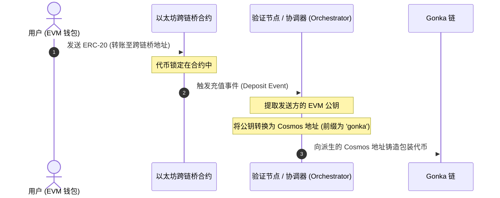
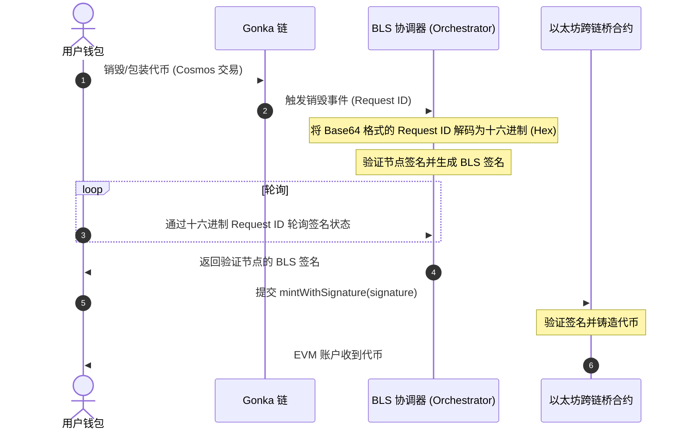

# 技术集成指南：兑换与跨链桥组件

本指南为希望在其自定义仪表盘中重建兑换与跨链桥组件的社区开发者提供技术规范、架构设计和实现步骤。

---

## 1. 架构概述

为避免结构性混淆，充值与提现的资产流被拆分为两个独立的过程。

### A. 充值流程（EVM 至 Gonka）与地址派生
在充值过程中，代币会被锁定在以太坊（Ethereum）上，并根据发送方 EVM 公钥派生的 Cosmos 地址，在 Gonka 上铸造等值的包装代币。这就是可能发生地址派生不匹配的地方：



### B. 提现 / 解包装流程（Gonka 至 EVM）
在提现过程中，代币在 Cosmos 侧被销毁，轮询验证节点的 BLS 签名，然后在以太坊侧进行领回（铸造）：



---

## 2. 充值功能

### A. IBC 充值（Cosmos 至 Gonka）
IBC 充值将资产直接从 Cosmos 源链（例如 Osmosis、Cosmos Hub、Injective）转移到 Gonka。

1. **启用并连接源链**：向 Keplr 查询源链凭证。
```typescript
async function connectSourceChain(chainId: string) {
  const walletProvider = (window as any).keplr;
  if (!walletProvider) throw new Error("未找到 Cosmos 钱包扩展。");
  
  await walletProvider.enable(chainId);
  const offlineSigner = walletProvider.getOfflineSigner(chainId);
  const accounts = await offlineSigner.getAccounts();
  return { address: accounts[0].address, offlineSigner };
}
```

2. **解析通道路由**：查询 Gonka RPC 通道元数据（`/ibc/core/channel/v1/channels`）以解析交易对手路径。
```typescript
async function resolveIbcChannel(apiEndpoint: string, targetChainId: string): Promise<string | null> {
  const response = await fetch(`${apiEndpoint}/ibc/core/channel/v1/channels`).then(r => r.json());
  const channels = response?.channels || [];

  for (const channel of channels) {
    if (channel.state !== 'STATE_OPEN' || channel.port_id !== 'transfer') continue;

    const clientData = await fetch(
      `${apiEndpoint}/ibc/core/channel/v1/channels/${channel.channel_id}/ports/transfer/client_state`
    ).then(r => r.json());
    
    const clientChainId = clientData?.identified_client_state?.client_state?.chain_id || 
                          clientData?.client_state?.chain_id;

    if (clientChainId === targetChainId) {
      return channel.counterparty?.channel_id || null;
    }
  }
  return null;
}
```

3. **执行 IBC 转账**：从源链发送标准的 CosmJS `MsgTransfer`。

```typescript
import { SigningStargateClient } from '@cosmjs/stargate';

async function initiateIbcDeposit(
  sourceChainId: string,
  sourcePort: string,    // 例如 'transfer'
  sourceChannel: string, // 例如 'channel-0'
  denom: string,         // 例如 'uusdt'
  amount: string,        // 基础单位数量
  senderSourceAddress: string,
  receiverGonkaAddress: string,
  offlineSigner: any,
  rpcUrl: string
) {
  const client = await SigningStargateClient.connectWithSigner(rpcUrl, offlineSigner);
  
  const timeoutTimestamp = (BigInt(Date.now()) + 600_000n) * 1_000_000n; // 10分钟超时（纳秒）

  const response = await client.sendIbcTokens(
    senderSourceAddress,  // 源链发送方地址（如 Osmosis 地址）
    receiverGonkaAddress, // Gonka 链接收方地址
    { denom, amount },
    sourcePort,
    sourceChannel,
    undefined, // timeoutHeight
    Number(timeoutTimestamp) / 1_000_000_000, // 超时时间（秒）
    { amount: [], gas: '200000' } // 手续费
  );
  
  return response.transactionHash;
}
```

### B. EVM 跨链桥充值（EVM 至 Gonka）
EVM 充值涉及在 EVM 源链上锁定 ERC-20 资产，以在 Gonka 上铸造相应的代币。交易流程包含以下步骤：

1. **验证 EVM 地址密钥不匹配 (Key-Mismatch)**：验证当前活动的 EVM 地址所派生的 Cosmos 地址是否与连接 of Keplr 公钥相匹配。
   
   **核心问题**  
   当用户通过标准的软件助记词连接时，其 EVM 钱包 (MetaMask) 会使用币种类型 `60` 来派生地址，而其 Cosmos 钱包 (Keplr) 会使用币种类型 `118` 或 `1200` 来派生地址。
   * 由于这些派生路径不同，其 EVM 公钥和 Cosmos 公钥并**不**一致。
   * 以太坊跨链桥合约会捕获充值 EVM 地址的公钥，并基于**直接从该 EVM 公钥派生**的 Bech32 地址在 Gonka 上铸造代币。
   * 如果发生因助记词派生引起的不匹配，代币将被铸造到与当前活跃的 Keplr 钱包完全**不同**的 Cosmos 地址，从而导致资金丢失！

   **解决方案：密钥验证清单**  
   在允许用户充值之前，请执行以下验证：

   ```typescript
   import { toBech32 } from '@cosmjs/encoding';

   async function verifyAddressMismatch(
     activeEvmAddress: string,
     cosmosChainId: string,
     currentCosmosAddress: string,
     bech32Prefix: string = 'gonka'
   ) {
     // 1. 获取活跃的钱包提供商 (Keplr)
     const walletProvider = (window as any).keplr;
     if (!walletProvider) return { isMismatch: false };

     // 2. 从 Cosmos 钱包获取密钥属性
     const key = await walletProvider.getKey(cosmosChainId);
     const derivedEvmAddress = key.ethereumHexAddress;

     if (!derivedEvmAddress) {
       console.warn("钱包提供商不支持 EVM 地址检查。");
       return { isMismatch: false };
     }

     // 3. 比较活动的 EVM 地址与密钥的 EVM 地址
     const isMismatch = activeEvmAddress.toLowerCase() !== derivedEvmAddress.toLowerCase();

     if (isMismatch) {
       // 4. 通过解码 EVM 十六进制并编码为 Bech32 来派生代币将落入的目标地址
       const rawHex = activeEvmAddress.startsWith('0x') ? activeEvmAddress.substring(2) : activeEvmAddress;
       const hexBytes = new Uint8Array(
         rawHex.match(/.{1,2}/g)?.map((byte: string) => parseInt(byte, 16)) || []
       );
       const targetCosmosAddress = toBech32(bech32Prefix, hexBytes);

       return {
         isMismatch: true,
         targetCosmosAddress,      // 代币将铸造到此地址
         expectedEvmAddress: derivedEvmAddress // 用户必须在 MetaMask 中切换到此 EVM 地址
       };
     }

     return { isMismatch: false };
   }
   ```

2. **解析跨链桥合约地址**：从注册表 API 获取目标代币已获批的跨链桥合约地址。
   ```typescript
   async function resolveBridgeAddress(apiEndpoint: string, chainId: string): Promise<string> {
     const response = await fetch(
       `${apiEndpoint}/productscience/inference/inference/bridge_addresses/${chainId}`
     ).then(r => r.json());
     
     const address = response?.bridge_address || response?.address || response?.approved_bridge_address;
     if (!address) {
       throw new Error(`无法解析链的跨链桥地址: ${chainId}`);
     }
     return address;
   }
   ```

3. **切换 EVM 网络**：验证并请求切换（`wallet_switchEthereumChain`）到正确的以太坊网络（主网或 Sepolia 测试网）。
   ```typescript
   async function switchEvmNetwork(ethProvider: any, isTestnet: boolean) {
     const targetChainIdHex = isTestnet ? '0xaa36a7' : '0x1'; // Sepolia 或主网
     try {
       await ethProvider.request({
         method: 'wallet_switchEthereumChain',
         params: [{ chainId: targetChainIdHex }],
       });
     } catch (switchError: any) {
       if (switchError.code === 4902) {
         throw new Error(`请先将 ${isTestnet ? 'Sepolia' : 'Ethereum'} 网络添加到您的 EVM 钱包中。`);
       }
       throw switchError;
     }
   }
   ```

4. **执行 ERC-20 转账**：生成 ERC-20 `transfer(bridgeAddress, amount)` ABI 调用数据，并通过 EVM 提供商将其发送到 ERC-20 代币合约地址。

   > **警告：**  
   > 充值 ERC-20 代币时，**请勿**直接向跨链桥合约地址发送原始交易。相反，您必须将 **ERC-20 代币合约地址**作为接收方 (`to`)，并传递表示 `transfer(bridgeContractAddress, amount)` 函数调用的编码数据载荷 (data payload)。

   ```typescript
   // 1. 手动编码 ERC-20 transfer(address to, uint256 value) 函数调用
   // transfer(address,uint256) 的方法选择器是 0xa9059cbb
   const methodId = '0xa9059cbb';
   const toPadding = bridgeContractAddress.replace(/^0x/i, '').padStart(64, '0');
   const amountHex = amountInBaseUnits.toString(16).padStart(64, '0');
   const data = methodId + toPadding + amountHex;

   // 2. 发送针对 ERC-20 代币合约地址的交易
   // （解析 Keplr 注入的 EVM 提供商或标准的 window.ethereum）
   const ethProvider = (window as any).keplr?.ethereum || (window as any).ethereum;
   if (!ethProvider) throw new Error("未找到 EVM 提供商。");

   await ethProvider.request({
     method: 'eth_sendTransaction',
     params: [{
       from: activeEvmAddress,
       to: erc20ContractAddress, // 目标是 ERC-20 合约地址
       data: data                // 编码后的调用数据，将代币转账至 bridgeContractAddress
     }],
   });
   ```

---

## 3. 提现功能

### A. IBC 提现（Gonka 至 Cosmos）
IBC 提现将资产直接从 Gonka 转移回 Cosmos 目的链（例如 Osmosis、Cosmos Hub、Injective）。

1. **解析本地通道**：查询 Gonka RPC 通道列表元数据（`/ibc/core/channel/v1/channels`）以解析指向目的链的通道。
2. **执行 IBC 转账**：在 Gonka 链上发送标准的 CosmJS `MsgTransfer`。

```typescript
import { SigningStargateClient } from '@cosmjs/stargate';

async function initiateIbcWithdraw(
  gonkaChainId: string,
  localChannel: string,   // 例如 'channel-0'
  denom: string,          // 例如 'ibc/...' 或原生代币名称
  amount: string,         // 基础单位数量
  senderGonkaAddress: string,
  receiverCosmosAddress: string,
  offlineSigner: any,
  rpcUrl: string
) {
  const client = await SigningStargateClient.connectWithSigner(rpcUrl, offlineSigner);
  
  const timeoutTimestamp = (BigInt(Date.now()) + 600_000n) * 1_000_000n; // 10分钟超时（纳秒）

  const response = await client.sendIbcTokens(
    senderGonkaAddress,    // Gonka 链发送方地址
    receiverCosmosAddress, // 目的链接收方地址
    { denom, amount },
    'transfer',
    localChannel,
    undefined, // timeoutHeight
    Number(timeoutTimestamp) / 1_000_000_000, // 超时时间（秒）
    { amount: [], gas: '200000' } // 手续费
  );
  
  return response.transactionHash;
}
```

---

### B. EVM 跨链桥提现（多阶段解包装）
将代币从 Gonka 解包装回以太坊是一个异步过程，由三个不同的步骤组成，并且在开始前必须先进行一项关键的验证检查：

#### 前提条件：跨链桥纪元同步验证 (Bridge Epoch Synced)
为了保证提现成功处理，在启动解包装交易流程*之前*，请验证以太坊跨链桥合约的纪元 (Epoch) 是否与当前的 Gonka 链纪元保持同步。如果跨链桥落后，您必须提示用户在跨链桥合约上注册缺失的纪元。

```typescript
import { ethers } from 'ethers';

const BRIDGE_ABI = [
  'function getLatestEpochInfo() view returns (uint64 epochId, uint64 timestamp, bytes groupKey)',
  'function getCurrentState() view returns (uint8)',
  'function isValidEpoch(uint64 epochId) view returns (bool)',
  'function submitGroupKey(uint64 epochId, bytes groupPublicKey, bytes validationSig) external',
];

// 1. 获取当前跨链桥纪元状态
async function checkBridgeEpochStatus(
  bridgeAddress: string,
  chainEpoch: number,
  ethProvider: any
): Promise<{ isSynced: boolean; bridgeEpoch: number }> {
  const provider = new ethers.BrowserProvider(ethProvider);
  const contract = new ethers.Contract(bridgeAddress, BRIDGE_ABI, provider);

  const latestInfo = await contract.getLatestEpochInfo();
  const bridgeEpoch = Number(latestInfo.epochId);

  return {
    bridgeEpoch,
    isSynced: bridgeEpoch >= chainEpoch,
  };
}

// 2. 从协调器 (Orchestrator) API 获取缺失的 BLS 纪元注册数据
async function fetchEpochBLSData(apiBase: string, epochId: number) {
  const data = await fetch(`${apiBase}/bls/epochs/${epochId}`).then(r => r.json());
  
  // 辅助函数：将 base64 转换为 hex
  const base64ToHex = (b64: string) => {
    const bytes = Uint8Array.from(atob(b64), c => c.charCodeAt(0));
    return '0x' + Array.from(bytes).map(b => b.toString(16).padStart(2, '0')).join('');
  };

  return {
    groupPublicKeyHex: base64ToHex(data.group_public_key_uncompressed_256),
    validationSignatureHex: base64ToHex(data.validation_signature_uncompressed_128),
  };
}

// 3. 在以太坊跨链桥上按顺序注册缺失的纪元
async function syncMissingEpochs(
  bridgeAddress: string,
  targetEpochId: number,
  apiBase: string,
  ethProvider: any
) {
  const provider = new ethers.BrowserProvider(ethProvider);
  const signer = await provider.getSigner();
  const contract = new ethers.Contract(bridgeAddress, BRIDGE_ABI, signer);

  // 检查目标纪元是否已经有效
  const isValid = await contract.isValidEpoch(targetEpochId);
  if (isValid) return;

  const latestInfo = await contract.getLatestEpochInfo();
  const latestContractEpoch = Number(latestInfo.epochId);

  // 按顺序为每个缺失的纪元提交群组密钥 (Group Key)
  for (let epoch = latestContractEpoch + 1; epoch <= targetEpochId; epoch++) {
    const epochData = await fetchEpochBLSData(apiBase, epoch);
    const tx = await contract.submitGroupKey(
      epoch,
      epochData.groupPublicKeyHex,
      epochData.validationSignatureHex
    );
    await tx.wait();
  }
}
```

如果跨链桥落后（`chainEpoch > bridgeEpoch`），应提示用户触发按顺序执行的纪元同步（`syncMissingEpochs`），然后才允许他们继续进行第 1 阶段（销毁资产）。

---

### 第 1 阶段：在 Gonka 上销毁/包装代币
执行 Cosmos SDK 交易。这可以是标准的 CW20 执行消息（销毁包装代币），也可以是自定义的原生桥解包装交易类型，具体取决于您的网络实现：

```typescript
// 自定义跨链桥销毁/解包装 Msg 类型注册（用于原生 GNK -> WGNK 解包装）
export const MsgRequestBridgeMintType = {
  typeUrl: '/inference.inference.MsgRequestBridgeMint',
  create(message: any) {
    return message;
  },
  fromPartial(message: any) {
    return message;
  },
  encode(message: any, writer: any) {
    // 需要标准字段：
    // - creator: string (Gonka 上的发送者地址)
    // - amount: string (基础单位数量)
    // - destinationAddress: string (接收方 EVM 地址)
    // - chainId: string (例如 'ethereum')
    // - destinationBridgeAddress: string (EVM 跨链桥合约地址)
    return writer;
  },
  decode() {
    return {};
  }
};
```

### 第 2 阶段：解析 Request ID 与 BLS 签名轮询
当销毁交易在 Gonka 上完成时，它会触发一个包含 `request_id` 的 Cosmos 交易事件。

> **重要提示：**  
> **Base64 转换为 Hex**：  
> Cosmos 事件中返回的 `request_id` 事件属性是 **Base64 编码**的（例如 `YIDIsACluy5BFS7YaHRXwOhWsYFa8274EyCwNCKy424=`）。  
> 在轮询协调器之前，您**必须**将此 Base64 字符串直接解码为原始字节数组，然后将其转换为 **32 字节的十六进制 (Hex) 字符串**（例如 `0x6080c8b000a5bb2...`）。  
> **请勿**对 Base64 字符串应用任何哈希函数（如 Keccak256 或 SHA-256），因为那会产生错误的请求 ID。

```typescript
function base64ToHex(base64Str: string): string {
  const binary = atob(base64Str);
  const bytes = new Uint8Array(binary.length);
  for (let i = 0; i < binary.length; i++) {
    bytes[i] = binary.charCodeAt(i);
  }
  return '0x' + Array.from(bytes).map(b => b.toString(16).padStart(2, '0')).join('');
}
```

轮询 BLS 签名端点（`/api/v1/bls/signatures/{hexRequestId}`），直到验证节点生成有效的签名：

```typescript
// 注意后端的 enum 表示形式（整数 vs 字符串）
// 例如，状态 3 或 'THRESHOLD_SIGNING_STATUS_COMPLETED' 代表成功
const COMPLETED_STATUSES = new Set([3, '3', 'THRESHOLD_SIGNING_STATUS_COMPLETED']);
const FAILED_STATUSES = new Set([4, '4', 'THRESHOLD_SIGNING_STATUS_FAILED']);

async function pollBlsSignature(apiBase: string, hexRequestId: string): Promise<any> {
  const url = `${apiBase}/bls/signatures/${hexRequestId.replace(/^0x/, '')}`;
  
  while (true) {
    const data = await fetch(url).then(r => r.json());
    
    if (COMPLETED_STATUSES.has(data?.status)) {
      return data.signature; // 签名获取成功
    }
    if (FAILED_STATUSES.has(data?.status)) {
      throw new Error(`签名生成失败: ${data.message || '未知原因'}`);
    }
    
    await new Promise(resolve => setTimeout(resolve, 3000)); // 每 3 秒轮询一次
  }
}
```

### 第 3 阶段：在以太坊合约上铸造
调用以太坊跨链桥合约上的 `mintWithSignature`，提交验证节点的签名数据。

```typescript
import { ethers } from 'ethers';

const BRIDGE_ABI = [
  'function withdraw((uint64 epochId, bytes32 requestId, address recipient, address tokenContract, uint256 amount, bytes signature) cmd) external',
  'function mintWithSignature((uint64 epochId, bytes32 requestId, address recipient, uint256 amount, bytes signature) cmd) external',
];

async function mintOnEthereum(
  ethProvider: any,
  bridgeAddress: string,
  mintParams: {
    epochId: number;
    requestId: string; // 32 字节 hex 字符串 (0x...)
    recipient: string;
    amount: string;
    signature: string; // 128 字节 hex 签名
    tokenContract?: string; // ERC-20 解包装所需
    isNativeGNK?: boolean;
  }
) {
  const provider = new ethers.BrowserProvider(ethProvider);
  const signer = await provider.getSigner();
  const contract = new ethers.Contract(bridgeAddress, BRIDGE_ABI, signer);

  let tx;
  if (mintParams.isNativeGNK) {
    const cmd = {
      epochId: mintParams.epochId,
      requestId: mintParams.requestId,
      recipient: mintParams.recipient,
      amount: mintParams.amount,
      signature: mintParams.signature,
    };
    tx = await contract.mintWithSignature(cmd);
  } else {
    const cmd = {
      epochId: mintParams.epochId,
      requestId: mintParams.requestId,
      recipient: mintParams.recipient,
      tokenContract: mintParams.tokenContract,
      amount: mintParams.amount,
      signature: mintParams.signature,
    };
    tx = await contract.withdraw(cmd);
  }

  const receipt = await tx.wait();
  if (!receipt || receipt.status === 0) {
    throw new Error('交易在链上 Revert');
  }
  return receipt.hash;
}
```

---

## 4. 弹性恢复系统 (恢复/缓存) (推荐/可选)

为了防止用户在浏览器崩溃、网络断开或标签页关闭时丢失交易状态，强烈建议（虽然是可选的）实现**弹性缓存模式 (Resilience Caching Pattern)**：

1. **在广播第 1 阶段之前立即写入缓存**：
   ```typescript
   const cacheKey = `pending_unwrap_${userCosmosAddress}`;
   localStorage.setItem(cacheKey, JSON.stringify({
     status: 'burning',
     gonkaTxHash: '',
     amount: amountInBaseUnits,
     destinationEthAddress,
     step: 1
   }));
   ```
2. **在 Gonka 交易广播中及 `request_id` 被解析时更新缓存**。
3. **在组件挂载 (Mount) 时**：检查 `localStorage.getItem(cacheKey)` 是否存在。如果存在，显示一个**“检测到待处理交易”**卡片，允许用户选择：
   * **恢复交易 (Resume Transaction)**：恢复状态并直接跳转到第 2 阶段（轮询 BLS 签名）或第 3 阶段（EVM 铸造）。
   * **放弃 (Discard)**：清除 `localStorage` 键。

---

## 5. 代币列表解析与元数据收集

为了提供无缝的用户体验，该组件从 Cosmos 和以太坊链中动态查询并解析可用资产及其元数据（符号、小数位数）。

### A. 充值代币列表 (`allDepositTokens`)
充值下拉菜单显示用户可以桥接*到* Gonka 的资产列表。该列表的构建方式如下：

1. **已获批代币查询**：
   * 从后端注册表获取可交易/可跨链的代币列表：`blockchain.getApprovedTokensForTrade()`。
2. **动态注入 WGNK**：
   * 获取当前跨链桥合约地址：`blockchain.getBridgeAddresses('ethereum')`。
   * 如果解析出的跨链桥合约地址（WGNK）不在已获批的代币列表中，则会将其动态追加为 `WGNK`（具有 9 位小数），以允许用户包装原生 GNK。

   ```typescript
   // 如果已获批代币列表中缺少 WGNK，则动态注入它
   const allDepositTokens = computed(() => {
     const list = [...supportedIbcTokens.value, ...supportedEthTokens.value];
     if (resolvedBridgeAddress.value && resolvedBridgeAddress.value.startsWith('0x')) {
       const hasWgnk = list.some(
         t => t.symbol === 'WGNK' || 
         String(t.contractAddress).toLowerCase() === resolvedBridgeAddress.value.toLowerCase()
       );
       if (!hasWgnk) {
         list.push({
           chainId: 'ethereum',
           contractAddress: resolvedBridgeAddress.value,
           symbol: 'WGNK',
           decimals: 9,
           type: 'eth',
         });
       }
     }
     return list;
   });
   ```

3. **代币符号和小数位数解析**：
   * **Cosmos (IBC)**：将资产与离线元数据图谱匹配，或者查询 Cosmos 链银行元数据端点 `/cosmos/bank/v1beta1/denoms_metadata/{denom}`。
   * **以太坊（跨链桥）**：通过原生的 `eth_call` 操作查询公共 EVM RPC 节点：
     * `0x95d89b41`：调用 `symbol()` 以获取 ERC-20 符号。
     * `0x313ce567`：调用 `decimals()` 以获取 ERC-20 小数位数。

   ```typescript
   // 通过 JSON-RPC 的 eth_call 直接查询 ERC-20 元数据
   async function queryEvmRpc(to: string, data: string, rpcUrl: string): Promise<string> {
     const response = await fetch(rpcUrl, {
       method: 'POST',
       headers: { 'Content-Type': 'application/json' },
       body: JSON.stringify({
         jsonrpc: '2.0',
         method: 'eth_call',
         params: [{ to, data }, 'latest'],
         id: 1
       })
     }).then(r => r.json());
     return response?.result || '0x';
   }

   // 从 hex 字符串解析 ERC-20 符号名称
   function parseBytes32OrString(hex: string): string {
     if (!hex || hex === '0x') return '';
     const clean = hex.replace(/^0x/i, '');
     if (clean.length < 64) return '';

     const offset = parseInt(clean.substring(0, 64), 16);
     if (offset === 32 && clean.length >= 128) {
       const length = parseInt(clean.substring(64, 128), 16);
       if (length > 0 && length <= 1000) {
         const dataHex = clean.substring(128, 128 + length * 2);
         let str = '';
         for (let i = 0; i < dataHex.length; i += 2) {
           const charCode = parseInt(dataHex.substring(i, i + 2), 16);
           if (charCode >= 32 && charCode <= 126) {
             str += String.fromCharCode(charCode);
           }
         }
         return str.trim();
       }
     }
     return '';
   }
   ```

---

### B. 提现代币列表 (`withdrawableTokens`)
提现下拉菜单显示用户钱包中可以桥接*出* Gonka 的资产列表。该列表的构建方式如下：

1. **Cosmos 包装代币余额**：
   * 使用 Pinia store 操作查询用户在 Gonka 链上的 CW-20 包装代币余额：`blockchain.getWrappedTokenBalances(walletAddress.value)`。
2. **Cosmos 原生 IBC 余额**：
   * 使用 `blockchain.rpc.getBankBalances(walletAddress.value)` 查询标准的银行余额。
   * 过滤并将这些原始余额映射到获批的交易代币列表。
3. **动态注入 GNK**：
   * 从 store 获取用户的质押代币余额：`walletStore.balanceOfStakingToken`。
   * 如果他们拥有原生 GNK 余额，则将其动态注入到提现代币列表中（作为映射到以太坊跨链桥的解包装操作），以便他们可以将原生 GNK 解包装为 WGNK。

   ```typescript
   // 将包装代币余额与原生 GNK 代币质押余额合并以进行解包装
   const withdrawableTokens = computed(() => {
     const list = [...wrappedTokenBalances.value];
     if (walletAddress.value) {
       const gnkBalance = walletStore.balanceOfStakingToken;
       const gnkAmt = parseFloat(gnkBalance.amount || '0') / 1_000_000_000;
       const hasGnk = list.some(t => t.symbol === 'GNK');
       if (!hasGnk && gnkAmt > 0) {
         list.unshift({
           symbol: 'GNK',
           full_denom: gnkBalance.denom,
           formatted_balance: gnkAmt.toString(),
           decimals: 9,
           isNative: false,
           isGnk: true,
           token_info: {
             chainId: 'ethereum',
             contractAddress: '', // 动态映射到跨链桥合约
           }
         });
       }
     }
     return list;
   });
   ```
