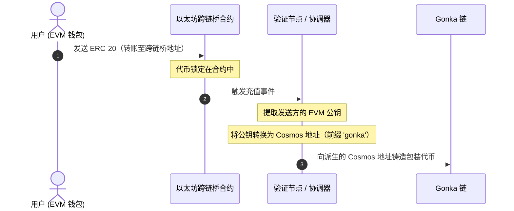
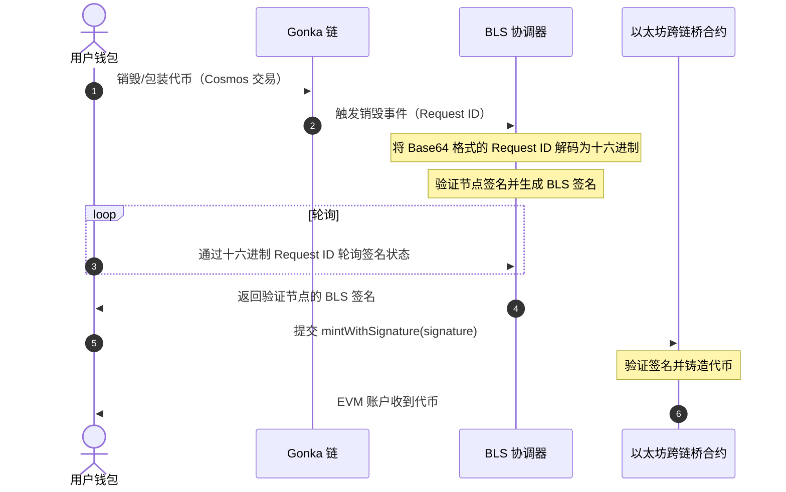

# 技术集成指南：兑换与跨链桥组件

本指南为希望在其自定义仪表盘中重建兑换与跨链桥组件的社区开发者提供技术规范、架构设计和实现步骤。

---

## 1. 架构概述

为避免结构性混淆，充值与提现的资产流被拆分为两个独立的过程。

### A. 充值流程（EVM 至 Gonka）与地址派生
在充值过程中，代币会被锁定在以太坊上，并根据发送方 EVM 公钥派生的 Cosmos 地址，在 Gonka 上铸造等值的包装代币。这就是可能发生地址派生不匹配的地方：



### B. 提现 / 解包装流程（Gonka 至 EVM）
在提现过程中，代币在 Cosmos 侧被销毁，轮询验证节点的 BLS 签名，然后在以太坊侧进行领回（铸造）：



---

## 2. 充值功能

### A. IBC 充值（Cosmos 至 Gonka）
IBC 充值将资产直接从 Cosmos 源链（例如 Osmosis、Cosmos Hub、Injective）转移到 Gonka。

1. **启用并连接源链**：向 Keplr 查询源链凭证。
    ```typescript
    async function connectSourceChain(chainId: string) {
      const walletProvider = (window as any).keplr;
      if (!walletProvider) throw new Error("Cosmos wallet extension not found.");
      
      await walletProvider.enable(chainId);
      const offlineSigner = walletProvider.getOfflineSigner(chainId);
      const accounts = await offlineSigner.getAccounts();
      return { address: accounts[0].address, offlineSigner };
    }
    ```

2. **解析通道路由**：查询 Gonka RPC 通道元数据（`/ibc/core/channel/v1/channels`）以解析交易对手路径。
    ```typescript
    async function resolveIbcChannel(nodeUrl: string, targetChainId: string): Promise<string | null> {
      const response = await fetch(`${nodeUrl}/ibc/core/channel/v1/channels`).then(r => r.json());
      const channels = response?.channels || [];

      for (const channel of channels) {
        if (channel.state !== 'STATE_OPEN' || channel.port_id !== 'transfer') continue;

        const clientData = await fetch(
          `${nodeUrl}/ibc/core/channel/v1/channels/${channel.channel_id}/ports/transfer/client_state`
        ).then(r => r.json());
        
        const clientChainId = clientData?.identified_client_state?.client_state?.chain_id || 
                              clientData?.client_state?.chain_id;

        if (clientChainId === targetChainId) {
          return channel.counterparty?.channel_id || null;
        }
      }
      return null;
    }
    ```

3. **执行 IBC 转账**：从源链发送标准的 CosmJS `MsgTransfer`。
    ```typescript
    import { SigningStargateClient } from '@cosmjs/stargate';

    async function initiateIbcDeposit(
      sourceChainId: string,
      sourcePort: string,    // e.g., 'transfer'
      sourceChannel: string, // e.g., 'channel-0'
      denom: string,         // e.g., 'uusdt'
      amount: string,        // In base units
      senderSourceAddress: string,
      receiverGonkaAddress: string,
      offlineSigner: any,
      rpcUrl: string
    ) {
      const client = await SigningStargateClient.connectWithSigner(rpcUrl, offlineSigner);
      
      const timeoutTimestamp = (BigInt(Date.now()) + 600_000n) * 1_000_000n; // 10 minutes timeout in nanoseconds

      const response = await client.sendIbcTokens(
        senderSourceAddress,  // Sender on source chain (e.g. Osmosis address)
        receiverGonkaAddress, // Receiver on Gonka chain
        { denom, amount },
        sourcePort,
        sourceChannel,
        undefined, // timeoutHeight
        Number(timeoutTimestamp) / 1_000_000_000, // timeoutTimestamp in seconds
        { amount: [], gas: '200000' } // Fee
      );
      
      return response.transactionHash;
    }
    ```

### B. EVM 跨链桥充值（EVM 至 Gonka）
EVM 充值涉及在 EVM 源链上锁定 ERC-20 资产，以在 Gonka 上铸造相应的代币。交易流程包含以下步骤：

1. **验证 EVM 地址密钥不匹配**：验证当前活动的 EVM 地址所派生的 Cosmos 地址是否与已连接的 Keplr 公钥相匹配。
   
    > **警告：EVM 地址密钥不匹配**  
    > 当用户通过标准的软件助记词连接时，其 EVM 钱包（MetaMask）会使用币种类型 `60` 来派生地址，而其 Cosmos 钱包（Keplr）会使用币种类型 `118` 或 `1200` 来派生地址。
    > * 由于这些派生路径不同，其 EVM 公钥和 Cosmos 公钥并**不**一致。
    > * 以太坊跨链桥合约会捕获充值 EVM 地址的公钥，并基于**直接从该 EVM 公钥派生**的 Bech32 地址在 Gonka 上铸造代币。
    > * 如果发生因助记词派生引起的不匹配，代币将被铸造到与当前活跃的 Keplr 钱包完全**不同**的 Cosmos 地址。资金并非永久丢失——用户仍可以从其助记词（币种类型 `60`）派生出以太坊私钥并使用它来访问接收代币的 Gonka 账户——但这需要手动的密钥派生步骤，大多数用户可能无法预料到。

    **解决方案：密钥验证清单**  
    在允许用户充值之前，请执行以下验证：

    ```typescript
    import { toBech32 } from '@cosmjs/encoding';
    import { ethers } from 'ethers';

    async function verifyAddressMismatch(
      activeEvmAddress: string,
      cosmosChainId: string,
      currentCosmosAddress: string,
      bech32Prefix: string = 'gonka'
    ) {
      // 1. Resolve active wallet provider (Keplr)
      const walletProvider = (window as any).keplr;
      if (!walletProvider) return { isMismatch: false };

      // 2. Fetch key properties from Cosmos wallet
      const key = await walletProvider.getKey(cosmosChainId);
      const pubKeyBytes = key.pubKey;
      if (!pubKeyBytes || pubKeyBytes.length === 0) {
        console.warn("Public key not available from provider.");
        return { isMismatch: false };
      }

      // 3. Derive the REAL Ethereum address from the Cosmos public key (keccak256-based)
      // NOTE: key.ethereumHexAddress is NOT the real EVM address — it is just the Cosmos 
      // address bytes (sha256+ripemd160) represented as hex, which will mismatch.
      const pubKeyHex = '0x' + Array.from(pubKeyBytes, (b) => b.toString(16).padStart(2, '0')).join('');
      const derivedEvmAddress = ethers.computeAddress(pubKeyHex);

      // 4. Compare active EVM address with derived EVM address
      const isMismatch = activeEvmAddress.toLowerCase() !== derivedEvmAddress.toLowerCase();

      if (isMismatch) {
        // 5. Derive where the tokens will land by decoding EVM hex and encoding as Bech32
        const rawHex = activeEvmAddress.startsWith('0x') ? activeEvmAddress.substring(2) : activeEvmAddress;
        const hexBytes = new Uint8Array(
          rawHex.match(/.{1,2}/g)?.map((byte: string) => parseInt(byte, 16)) || []
        );
        const targetCosmosAddress = toBech32(bech32Prefix, hexBytes);

        return {
          isMismatch: true,
          targetCosmosAddress,      // Tokens will mint here
          expectedEvmAddress: derivedEvmAddress // User must switch EVM wallet to this address
        };
      }

      return { isMismatch: false };
    }
    ```

2. **解析跨链桥合约地址**：从注册表 API 获取目标代币已获批的跨链桥合约地址。
    ```typescript
    async function resolveBridgeAddress(nodeUrl: string, chainId: string): Promise<string> {
      const response = await fetch(
        `${nodeUrl}/productscience/inference/inference/bridge_addresses/${chainId}`
      ).then(r => r.json());
      
      const address = response?.bridge_address || response?.address || response?.approved_bridge_address;
      if (!address) {
        throw new Error(`Failed to resolve bridge address for chain: ${chainId}`);
      }
      return address;
    }
    ```

3. **切换 EVM 网络**：验证并请求切换（`wallet_switchEthereumChain`）到正确的以太坊网络（主网或 Sepolia 测试网）。
    ```typescript
    async function switchEvmNetwork(ethProvider: any, isTestnet: boolean) {
      const targetChainIdHex = isTestnet ? '0xaa36a7' : '0x1'; // Sepolia or Mainnet
      try {
        await ethProvider.request({
          method: 'wallet_switchEthereumChain',
          params: [{ chainId: targetChainIdHex }],
        });
      } catch (switchError: any) {
        if (switchError.code === 4902) {
          throw new Error(`Please add the ${isTestnet ? 'Sepolia' : 'Ethereum'} network to your EVM wallet first.`);
        }
        throw switchError;
      }
    }
    ```

4. **执行 ERC-20 转账**：生成 ERC-20 `transfer(bridgeAddress, amount)` ABI 调用数据，并通过 EVM 提供商将其发送到 ERC-20 代币合约地址。

    > **警告：**  
    > 充值 ERC-20 代币时，**请勿**直接向跨链桥合约地址发送原始交易。相反，您必须将 **ERC-20 代币合约地址**作为接收方（`to`），并传递表示 `transfer(bridgeContractAddress, amount)` 函数调用的编码数据载荷。

    ```typescript
    // 1. Manually encode the ERC-20 transfer(address to, uint256 value) function call
    // Method selector for transfer(address,uint256) is 0xa9059cbb
    const methodId = '0xa9059cbb';
    const toPadding = bridgeContractAddress.replace(/^0x/i, '').padStart(64, '0');
    const amountHex = amountInBaseUnits.toString(16).padStart(64, '0');
    const data = methodId + toPadding + amountHex;

    // 2. Dispatch transaction targeting the ERC-20 Token Contract address
    // (Resolves either Keplr's injected EVM provider or standard window.ethereum)
    const ethProvider = (window as any).keplr?.ethereum || (window as any).ethereum;
    if (!ethProvider) throw new Error("No EVM provider found.");

    await ethProvider.request({
      method: 'eth_sendTransaction',
      params: [{
        from: activeEvmAddress,
        to: erc20ContractAddress, // Target the ERC-20 contract
        data: data                // Encoded call to transfer tokens to bridgeContractAddress
      }],
    });
    ```

---

## 3. 提现功能

### A. IBC 提现（Gonka 至 Cosmos）
IBC 提现将资产直接从 Gonka 转移回 Cosmos 目的链（例如 Osmosis、Cosmos Hub、Injective）。

1. **解析本地通道**：查询 Gonka RPC 通道列表元数据（`/ibc/core/channel/v1/channels`）以解析指向目的链的通道。
2. **执行 IBC 转账**：在 Gonka 链上发送标准的 CosmJS `MsgTransfer`。

    ```typescript
    import { SigningStargateClient } from '@cosmjs/stargate';

    async function initiateIbcWithdraw(
      gonkaChainId: string,
      localChannel: string,   // e.g., 'channel-0'
      denom: string,          // e.g., 'ibc/...' or native denom
      amount: string,         // In base units
      senderGonkaAddress: string,
      receiverCosmosAddress: string,
      offlineSigner: any,
      rpcUrl: string
    ) {
      const client = await SigningStargateClient.connectWithSigner(rpcUrl, offlineSigner);
      
      const timeoutTimestamp = (BigInt(Date.now()) + 600_000n) * 1_000_000n; // 10 minutes timeout in nanoseconds

      const response = await client.sendIbcTokens(
        senderGonkaAddress,    // Sender on Gonka chain
        receiverCosmosAddress, // Receiver on destination chain
        { denom, amount },
        'transfer',
        localChannel,
        undefined, // timeoutHeight
        Number(timeoutTimestamp) / 1_000_000_000, // timeoutTimestamp in seconds
        { amount: [], gas: '200000' } // Fee
      );
      
      return response.transactionHash;
    }
    ```

---

### B. EVM 跨链桥提现（多阶段解包装）
将代币从 Gonka 解包装回以太坊是一个异步过程，由三个不同的步骤组成，并且在开始前必须先进行一项关键的验证检查：

#### 前提条件：跨链桥纪元同步验证
为了保证提现成功处理，在启动解包装交易流程*之前*，请验证以太坊跨链桥合约的纪元（Epoch）是否与当前的 Gonka 链纪元保持同步。如果跨链桥落后，您必须提示用户在跨链桥合约上注册缺失的纪元。

```typescript
import { ethers } from 'ethers';

const BRIDGE_ABI = [
  'function getLatestEpochInfo() view returns (uint64 epochId, uint64 timestamp, bytes groupKey)',
  'function getCurrentState() view returns (uint8)',
  'function isValidEpoch(uint64 epochId) view returns (bool)',
  'function submitGroupKey(uint64 epochId, bytes groupPublicKey, bytes validationSig) external',
];

// 1. Fetch current bridge epoch status
async function checkBridgeEpochStatus(
  bridgeAddress: string,
  chainEpoch: number,
  ethProvider: any
): Promise<{ isSynced: boolean; bridgeEpoch: number }> {
  const provider = new ethers.BrowserProvider(ethProvider);
  const contract = new ethers.Contract(bridgeAddress, BRIDGE_ABI, provider);

  const latestInfo = await contract.getLatestEpochInfo();
  const bridgeEpoch = Number(latestInfo.epochId);

  return {
    bridgeEpoch,
    isSynced: bridgeEpoch >= chainEpoch,
  };
}

// 2. Fetch missing BLS epoch registration data from Orchestrator API
async function fetchEpochBLSData(orchestratorUrl: string, epochId: number) {
  const data = await fetch(`${orchestratorUrl}/bls/epochs/${epochId}`).then(r => r.json());
  
  // Helper to convert base64 to hex
  const base64ToHex = (b64: string) => {
    const bytes = Uint8Array.from(atob(b64), c => c.charCodeAt(0));
    return '0x' + Array.from(bytes).map(b => b.toString(16).padStart(2, '0')).join('');
  };

  return {
    groupPublicKeyHex: base64ToHex(data.group_public_key_uncompressed_256),
    validationSignatureHex: base64ToHex(data.validation_signature_uncompressed_128),
  };
}

// 3. Sequentially register missing epochs on the Ethereum Bridge
async function syncMissingEpochs(
  bridgeAddress: string,
  targetEpochId: number,
  orchestratorUrl: string,
  ethProvider: any
) {
  const provider = new ethers.BrowserProvider(ethProvider);
  const signer = await provider.getSigner();
  const contract = new ethers.Contract(bridgeAddress, BRIDGE_ABI, signer);

  // Check if target epoch is already valid
  const isValid = await contract.isValidEpoch(targetEpochId);
  if (isValid) return;

  const latestInfo = await contract.getLatestEpochInfo();
  const latestContractEpoch = Number(latestInfo.epochId);

  // Sequentially submit group keys for each missing epoch
  for (let epoch = latestContractEpoch + 1; epoch <= targetEpochId; epoch++) {
    const epochData = await fetchEpochBLSData(orchestratorUrl, epoch);
    const tx = await contract.submitGroupKey(
      epoch,
      epochData.groupPublicKeyHex,
      epochData.validationSignatureHex
    );
    await tx.wait();
  }
}
```

如果跨链桥落后（`chainEpoch > bridgeEpoch`），应提示用户触发按顺序执行的纪元同步（`syncMissingEpochs`），然后才允许他们继续进行第 1 阶段（销毁资产）。

---

#### 第 1 阶段：在 Gonka 上销毁/包装代币
执行 Cosmos SDK 交易以请求跨链桥解包装。这可以是标准的 CW-20 合约执行消息（销毁/解包装包装代币），也可以是自定义的原生跨链桥解包装交易类型（将原生 GNK 解包装为 WGNK）。

##### **A. 自定义注册表设置**

如果您使用自定义注册表来签署自定义消息类型（如 `MsgRequestBridgeMint`），您**必须**同时注册标准的 CosmWasm 类型（如包含 `/cosmwasm.wasm.v1.MsgExecuteContract` 的 `wasmTypes`）。否则会导致 CW-20 交易中出现 "Unregistered type URL" 错误。

```typescript
import { Registry } from '@cosmjs/proto-signing';
import { defaultRegistryTypes } from '@cosmjs/stargate';
import { wasmTypes } from '@cosmjs/cosmwasm-stargate';

// Custom bridge burn / unwrap Msg type registration (for native GNK -> WGNK unwrap)
export const MsgRequestBridgeMintType = {
  typeUrl: '/inference.inference.MsgRequestBridgeMint',
  create(message: any) { return message; },
  fromPartial(message: any) { return message; },
  encode(message: any, writer: any) {
    // Requires standard fields: creator, amount, destinationAddress, chainId, destinationBridgeAddress
    return writer;
  },
  decode() { return {}; }
};

const customRegistry = new Registry([
  ...defaultRegistryTypes,
  ...wasmTypes, // Crucial for /cosmwasm.wasm.v1.MsgExecuteContract
  ['/inference.inference.MsgRequestBridgeMint', MsgRequestBridgeMintType as any]
]);
```

##### **B. 消息构建**
根据要解包装的资产类型，构建原生解包装消息或 CW-20 执行消息：

```typescript
// 1. For Native GNK -> WGNK:
const msg = {
  typeUrl: '/inference.inference.MsgRequestBridgeMint',
  value: {
    creator: senderAddress,
    amount: amountInBaseUnits,
    destinationAddress: recipientEthAddress,
    chainId: 'ethereum',
    destinationBridgeAddress: bridgeContractAddress,
  },
};

// 2. For CW-20 Wrapped Tokens (e.g. USDT, USDC):
const withdrawMsg = {
  withdraw: {
    amount: amountInBaseUnits,
    destination_bridge_address: bridgeContractAddress,
    destination_address: recipientEthAddress,
  },
};

const msg = {
  typeUrl: '/cosmwasm.wasm.v1.MsgExecuteContract',
  value: {
    sender: senderAddress,
    contract: cw20ContractAddress,
    msg: new TextEncoder().encode(JSON.stringify(withdrawMsg)),
    funds: [],
  },
};
```

##### **C. 本地交易哈希计算与索引器回退**
在禁用了交易索引（`tx_index = "off"`）的 Cosmos 节点上，通过 `client.broadcastTx()` 广播交易可能会抛出 `transaction indexing is disabled` 错误，即使交易已成功提交。

为了支持这些节点，请手动签署交易，通过对签名后的 `TxRaw` 字节进行 SHA-256 预计算交易哈希，并捕获索引器错误：

```typescript
import { toHex } from '@cosmjs/encoding';
import { sha256 } from '@cosmjs/crypto';
import { TxRaw } from 'cosmjs-types/cosmos/tx/v1beta1/tx';

async function signAndBroadcastWithIndexerFallback(
  client: SigningCosmWasmClient,
  senderAddress: string,
  messages: any[]
): Promise<{ transactionHash: string; hasEvents: boolean }> {
  // Sign manually using customRegistry
  const txRaw = await client.sign(senderAddress, messages, 'auto', '');
  const txBytes = TxRaw.encode(txRaw).finish();
  
  // Pre-calculate Tx Hash (SHA-256)
  const txHash = toHex(sha256(txBytes)).toUpperCase();

  try {
    const result = await client.broadcastTx(txBytes);
    return { transactionHash: result.transactionHash, hasEvents: true };
  } catch (error: any) {
    if (error.message.includes('transaction indexing is disabled')) {
      // The transaction was broadcast successfully, but the node will not return events
      return { transactionHash: txHash, hasEvents: false };
    }
    throw error;
  }
}
```

---

#### 第 2 阶段：解析 Request ID 与 BLS 签名轮询
当销毁交易在 Gonka 上完成时，您需要提取 `request_id` 和 `epoch_id` 以轮询验证者的签名。

##### **A. 获取请求详情（基于事件 vs. 历史查询回退）**
如果 RPC 节点启用了交易索引，您可以直接从交易事件中读取 `request_id`。否则，您必须查询协调器的状态历史端点来查找请求。

```typescript
// 1. Event-based Resolution (Indexing Enabled)
function parseUnwrapEvents(txResult: any): { requestId: string; epochId: number } {
  const blsEvent = txResult.events?.find((e: any) => e.type.includes('EventThresholdSigningRequested'));
  if (!blsEvent) throw new Error('BLS signing request event not found.');

  const getAttr = (key: string) => blsEvent.attributes.find((a: any) => a.key === key).value.replace(/^"|"$/g, '');
  return {
    requestId: getAttr('request_id'),
    epochId: parseInt(getAttr('current_epoch_id'), 10),
  };
}

// 2. State History Fallback (Indexing Disabled / tx_index = "off")
// Query the Cosmos node's state history registry: `GET {nodeUrl}/productscience/inference/bls/signing_history?pagination.limit=100&pagination.reverse=true`
// 
// Example Response:
// {
//   "signing_requests": [
//     {
//       "request_id": "9/Pl3Hztt0KrZTMOQvXv87lNSM+SC4wjuUbJbZU3z8Y=",
//       "current_epoch_id": "287",
//       "status": "THRESHOLD_SIGNING_STATUS_COMPLETED",
//       "created_block_height": "4438273",
//       "data": [
//         "AAAAAAAAAAAAAAAAAAAAAAAAAAAAAAAAAAAAAAAAAAE=",
//         "CsXlVAEeF4b1Bz8kMHvW1ii+NAmDSyqIoH38Wvmzcu4="
//       ]
//     }
//   ]
// }
async function resolveRequestFromHistory(
  nodeUrl: string,
  recipientEthAddress: string,
  amount: string
): Promise<{ requestId: string; epochId: number }> {
  // Convert EVM hex address to Base64 (orchestrator storage format)
  const recipientHex = recipientEthAddress.toLowerCase().replace(/^0x/, '');
  const bytes = new Uint8Array(recipientHex.length / 2);
  for (let i = 0; i < bytes.length; i++) {
    bytes[i] = parseInt(recipientHex.substring(i * 2, i * 2 + 2), 16);
  }
  const recipientB64 = btoa(String.fromCharCode(...Array.from(bytes)));

  // Query signing history registry
  const url = `${nodeUrl}/productscience/inference/bls/signing_history?pagination.limit=100&pagination.reverse=true`;
  const res = await fetch(url).then(r => r.json());
  const requests = res.signing_requests || [];

  // Match recipient and amount
  const matches = requests.filter((r: any) => r.data && r.data.some((d: string) => d === recipientB64));
  if (matches.length === 0) throw new Error('Transaction not found in signing history');

  // Sort descending by block height to get the latest
  matches.sort((a: any, b: any) => parseInt(b.created_block_height) - parseInt(a.created_block_height));
  const matched = matches[0];

  // Convert Base64 request_id to hex
  const reqIdBytes = Uint8Array.from(atob(matched.request_id), c => c.charCodeAt(0));
  const reqIdHex = '0x' + Array.from(reqIdBytes).map(b => b.toString(16).padStart(2, '0')).join('');

  return {
    requestId: reqIdHex,
    epochId: parseInt(matched.current_epoch_id, 10),
  };
}
```

##### **B. BLS 签名轮询**
> **重要提示：**  
> **Base64 转换为 Hex**：  
> 如果您通过事件属性解析了 `request_id`（Base64 编码，例如 `YIDIsA...`），您**必须**将 Base64 字符串直接解码为字节，然后将其表示为 **32 字节的十六进制字符串**（例如 `0x6080c8...`）。**请勿**对 Base64 字符串应用 Keccak256 或 SHA-256 等哈希函数。

```typescript
function base64ToHex(base64Str: string): string {
  const binary = atob(base64Str);
  const bytes = new Uint8Array(binary.length);
  for (let i = 0; i < binary.length; i++) {
    bytes[i] = binary.charCodeAt(i);
  }
  return '0x' + Array.from(bytes).map(b => b.toString(16).padStart(2, '0')).join('');
}
```

轮询 BLS 签名端点（`{orchestratorUrl}/bls/signatures/{hexRequestId}`），直到验证节点生成有效的签名。

**响应示例**：
```json
{
  "signing_request": {
    "request_id": "9/Pl3Hztt0KrZTMOQvXv87lNSM+SC4wjuUbJbZU3z8Y=",
    "current_epoch_id": 287,
    "status": 3
  },
  "uncompressed_signature_128": "AAAAAAAAAAAAAAAAAAAAABii5ArDtPtnmRw87QXJJRLlMohL3+fEWhuVKJqrh..."
}
```

```typescript
// Watch out for backend enum representations (integers vs strings)
// e.g. status 3 or 'THRESHOLD_SIGNING_STATUS_COMPLETED' represents success
const COMPLETED_STATUSES = new Set([3, '3', 'THRESHOLD_SIGNING_STATUS_COMPLETED']);
const FAILED_STATUSES = new Set([4, '4', 'THRESHOLD_SIGNING_STATUS_FAILED']);

async function pollBlsSignature(orchestratorUrl: string, hexRequestId: string): Promise<string> {
  const url = `${orchestratorUrl}/bls/signatures/${hexRequestId.replace(/^0x/, '')}`;
  
  while (true) {
    const data = await fetch(url).then(r => r.json());
    const status = data?.signing_request?.status;
    
    if (COMPLETED_STATUSES.has(status)) {
      const sigBase64 = data?.uncompressed_signature_128;
      if (!sigBase64) {
        throw new Error('Signature completed but uncompressed_signature_128 is missing.');
      }
      
      // Convert 128-byte Base64 signature to Hex format for EVM submission
      const sigBytes = Uint8Array.from(atob(sigBase64), c => c.charCodeAt(0));
      const sigHex = '0x' + Array.from(sigBytes).map(b => b.toString(16).padStart(2, '0')).join('');
      return sigHex;
    }
    
    if (FAILED_STATUSES.has(status)) {
      throw new Error('BLS signature generation failed.');
    }
    
    await new Promise(resolve => setTimeout(resolve, 3000)); // Poll every 3 seconds
  }
}
```

#### 第 3 阶段：在以太坊合约上铸造
调用以太坊跨链桥合约上的 `mintWithSignature`，提交验证节点的签名数据。

```typescript
import { ethers } from 'ethers';

const BRIDGE_ABI = [
  'function withdraw((uint64 epochId, bytes32 requestId, address recipient, address tokenContract, uint256 amount, bytes signature) cmd) external',
  'function mintWithSignature((uint64 epochId, bytes32 requestId, address recipient, uint256 amount, bytes signature) cmd) external',
];

async function mintOnEthereum(
  ethProvider: any,
  bridgeAddress: string,
  mintParams: {
    epochId: number;
    requestId: string; // 32-byte hex string (0x...)
    recipient: string;
    amount: string;
    signature: string; // 128-byte hex signature
    tokenContract?: string; // Required for ERC-20 unwraps
    isNativeGNK?: boolean;
  }
) {
  const provider = new ethers.BrowserProvider(ethProvider);
  const signer = await provider.getSigner();
  const contract = new ethers.Contract(bridgeAddress, BRIDGE_ABI, signer);

  let tx;
  if (mintParams.isNativeGNK) {
    const cmd = {
      epochId: mintParams.epochId,
      requestId: mintParams.requestId,
      recipient: mintParams.recipient,
      amount: mintParams.amount,
      signature: mintParams.signature,
    };
    tx = await contract.mintWithSignature(cmd);
  } else {
    const cmd = {
      epochId: mintParams.epochId,
      requestId: mintParams.requestId,
      recipient: mintParams.recipient,
      tokenContract: mintParams.tokenContract,
      amount: mintParams.amount,
      signature: mintParams.signature,
    };
    tx = await contract.withdraw(cmd);
  }

  const receipt = await tx.wait();
  if (!receipt || receipt.status === 0) {
    throw new Error('Transaction reverted on-chain');
  }
  return receipt.hash;
}
```

---

## 4. 弹性恢复系统（恢复/缓存）（推荐 / 可选）

为了防止用户在浏览器崩溃、网络断开或标签页关闭时丢失交易状态，强烈建议（虽然是可选的）实现**弹性缓存模式**：

1. **在广播第 1 阶段之前立即写入缓存**：
    ```typescript
    const cacheKey = `pending_unwrap_${userCosmosAddress}`;
    localStorage.setItem(cacheKey, JSON.stringify({
      status: 'burning',
      gonkaTxHash: '',
      amount: amountInBaseUnits,
      destinationEthAddress,
      step: 1
    }));
    ```
2. **在 Gonka 交易广播中及 `request_id` 被解析时更新缓存**。
3. **在组件挂载（Mount）时**：检查 `localStorage.getItem(cacheKey)` 是否存在。如果存在，显示一个**"检测到待处理交易"**卡片，允许用户选择：
    * **恢复交易**：恢复状态并直接跳转到第 2 阶段（轮询 BLS 签名）或第 3 阶段（EVM 铸造）。
    * **放弃**：清除 `localStorage` 键。

---
## 5. 代币列表解析与元数据收集

为了提供无缝的用户体验，该组件从 Cosmos 和以太坊链中动态查询并解析可用资产及其元数据（符号、小数位数）。

### A. 充值代币列表（`allDepositTokens`）

充值下拉菜单显示用户可以跨链*到* Gonka 的资产列表。该列表通过合并和解析已获批代币和 WGNK 的元数据来构建：

* **已获批代币注册表**：从后端注册表获取可交易/可跨链的代币列表：`GET {nodeUrl}/productscience/inference/inference/approved_tokens_for_trade`。
* **动态注入 WGNK**：获取当前跨链桥合约地址（`GET {nodeUrl}/productscience/inference/inference/bridge_addresses/ethereum`）。如果解析出的跨链桥合约地址（WGNK）不在已获批的代币列表中，则动态追加 `WGNK`（9 位小数），以允许用户包装原生 GNK。
* **符号和精度解析**：
    * **Cosmos (IBC)**：将资产与离线元数据映射匹配，或查询 Cosmos 链银行元数据：`GET {nodeUrl}/cosmos/bank/v1beta1/denoms_metadata/{denom}`。
    * **以太坊（跨链桥）**：通过原始 `eth_call` 操作查询公共 EVM RPC 节点（`0x95d89b41` 调用 `symbol()`，`0x313ce567` 调用 `decimals()`）。

#### 实现示例
```typescript
// Inject WGNK dynamically if missing from the approved tokens list
const allDepositTokens = computed(() => {
  const list = [...supportedIbcTokens.value, ...supportedEthTokens.value];
  if (resolvedBridgeAddress.value && resolvedBridgeAddress.value.startsWith('0x')) {
    const hasWgnk = list.some(
      t => t.symbol === 'WGNK' || 
      String(t.contractAddress).toLowerCase() === resolvedBridgeAddress.value.toLowerCase()
    );
    if (!hasWgnk) {
      list.push({
        chainId: 'ethereum',
        contractAddress: resolvedBridgeAddress.value,
        symbol: 'WGNK',
        decimals: 9,
        type: 'eth',
      });
    }
  }
  return list;
});

// Direct ERC-20 metadata queries via JSON-RPC eth_call
async function queryEvmRpc(to: string, data: string, rpcUrl: string): Promise<string> {
  const response = await fetch(rpcUrl, {
    method: 'POST',
    headers: { 'Content-Type': 'application/json' },
    body: JSON.stringify({
      jsonrpc: '2.0',
      method: 'eth_call',
      params: [{ to, data }, 'latest'],
      id: 1
    })
  }).then(r => r.json());
  return response?.result || '0x';
}

// Parsing ERC-20 Symbol name from hex string
function parseBytes32OrString(hex: string): string {
  if (!hex || hex === '0x') return '';
  const clean = hex.replace(/^0x/i, '');
  if (clean.length < 64) return '';

  const offset = parseInt(clean.substring(0, 64), 16);
  if (offset === 32 && clean.length >= 128) {
    const length = parseInt(clean.substring(64, 128), 16);
    if (length > 0 && length <= 1000) {
      const dataHex = clean.substring(128, 128 + length * 2);
      let str = '';
      for (let i = 0; i < dataHex.length; i += 2) {
        const charCode = parseInt(dataHex.substring(i, i + 2), 16);
        if (charCode >= 32 && charCode <= 126) {
          str += String.fromCharCode(charCode);
        }
      }
      return str.trim();
    }
  }
  return '';
}
```

---

### B. 提现代币列表（`withdrawableTokens`）

提现下拉菜单显示用户钱包中可以跨链*出* Gonka 的资产列表。构建该列表需要合并三个子操作来整合不同的代币来源：

* **Cosmos 包装代币余额（CW-20）**：通过 REST API 端点查询用户在 Gonka 链上的 CW-20 包装代币余额：`GET {nodeUrl}/productscience/inference/inference/wrapped_token_balances/{walletAddress}`。
  
  **响应示例**：
  ```json
  {
    "balances": [
      {
        "token_info": {
          "chainId": "ethereum",
          "contractAddress": "0xa0b86991c6218b36c1d19d4a2e9eb0ce3606eb48",
          "wrappedContractAddress": "gonka1fa83z7np903k9vh63guy82qthtv373d7vjeq0y7xeqh50rzn8vtssffkre"
        },
        "symbol": "USDC",
        "balance": "15000000",
        "decimals": "6",
        "formatted_balance": "15.0"
      }
    ]
  }
  ```

!!! tip "可选建议：动态合约发现与缓存"
    如果您想动态发现 Gonka 链上部署的所有包装代币合约，可以查询在包装代币 code ID `105` 下部署的所有合约地址：
    
    `GET {nodeUrl}/cosmwasm/wasm/v1/code/105/contracts`
    
    **响应示例**：
    ```json
    {
      "contracts": [
        "gonka1fa83z7np903k9vh63guy82qthtv373d7vjeq0y7xeqh50rzn8vtssffkre",
        "gonka15ggwj9un6qrmu4nj5ev6l7kpdcr00td03ff2mmj4cyhl8u8vjd2qnl3hgk"
      ],
      "pagination": { "next_key": null, "total": "0" }
    }
    ```
    
    要获取每个合约地址的元数据（符号、名称、精度），请执行 `token_info` 的智能合约查询：
    
    `GET {nodeUrl}/cosmwasm/wasm/v1/contract/{contractAddress}/smart/eyJ0b2tlbl9pbmZvIjp7fX0=`
    *（其中 `eyJ0b2tlbl9pbmZvIjp7fX0=` 是 `{"token_info":{}}` 的 Base64 编码）*
    
    **响应示例**：
    ```json
    {
      "data": {
        "name": "USD Coin",
        "symbol": "USDC",
        "decimals": 6,
        "total_supply": "1400000"
      }
    }
    ```
    
    为了优化组件性能并避免重复的链上智能查询，我们强烈建议在本地缓存此合约元数据。
* **Cosmos 原生 IBC 余额**：使用银行模块 REST API 查询标准银行余额：`GET {nodeUrl}/cosmos/bank/v1beta1/balances/{address}`。
  
  **响应示例**：
  ```json
  {
    "balances": [
      {
        "denom": "ngonka",
        "amount": "1000000000"
      },
      {
        "denom": "ibc/ED07A3391A112B175915CD8FAF43A2153E30D7181A2E45558B93F44C2754781B",
        "amount": "5000000"
      }
    ],
    "pagination": { "next_key": null, "total": "2" }
  }
  ```
* **动态注入 GNK**：获取用户的原生 GNK（质押代币）余额。如果存在，将其动态注入到可提现代币列表中（映射为到以太坊跨链桥的解包装操作），以便他们可以将 GNK 解包装回 WGNK。

#### 实现示例
要构建最终的可提现代币列表，请获取余额并合并：

```typescript
async function getWrappedTokenBalances(nodeUrl: string, walletAddress: string) {
  const response = await fetch(`${nodeUrl}/productscience/inference/inference/wrapped_token_balances/${walletAddress}`);
  const data = await response.json();
  return data?.balances || [];
}

async function getIbcBalances(nodeUrl: string, walletAddress: string, ibcDenom: string) {
  const balUrl = `${nodeUrl}/cosmos/bank/v1beta1/balances/${walletAddress}/by_denom?denom=${encodeURIComponent(ibcDenom)}`;
  const response = await fetch(balUrl);
  const data = await response.json();
  return data?.balance?.amount || '0';
}

// Combine wrapped balances with native GNK token staking balances for unwrap
const withdrawableTokens = computed(() => {
  const list = [...wrappedTokenBalances.value]; // Contains both native IBC balances & CW20 wrapped balances
  if (walletAddress.value) {
    const gnkBalance = walletStore.balanceOfStakingToken;
    const gnkAmt = parseFloat(gnkBalance.amount || '0') / 1_000_000_000;
    const hasGnk = list.some(t => t.symbol === 'GNK');
    if (!hasGnk && gnkAmt > 0) {
      list.unshift({
        symbol: 'GNK',
        full_denom: gnkBalance.denom,
        formatted_balance: gnkAmt.toString(),
        decimals: 9,
        isNative: false,
        isGnk: true,
        token_info: {
          chainId: 'ethereum',
          contractAddress: '', // mapped dynamically to bridge contract
        }
      });
    }
  }
  return list;
});
```
